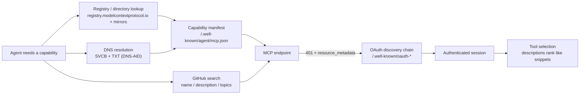

# AI agents

This part is about being found by an audience that never sees your homepage: AI agents acting on a user's intent. An agent goes from "a domain" to "a working session with your product" by walking four machine-readable surfaces — a registry listing, an OAuth discovery chain, a capability manifest, and DNS records — and if any load-bearing link is missing, the agent either never learns you exist or silently fails to connect. The good news: as of 2026-07 almost nobody has built this layer, so claiming it costs hours, not the years a competitive Google SERP costs.

## The walk: from a domain to a working session

When an agent (or the human directing one) wants a capability — "connect a domain", "create an invoice", "book an appointment" — it doesn't browse your marketing site. It walks this chain:

Each surface answers a different question, and each has a distinct failure mode when it's missing:

| Surface | Where it lives | What it answers for the agent | Failure mode if absent |
|---|---|---|---|
| **Registry listing** | `registry.modelcontextprotocol.io` + mirrors (mcp.so, Smithery, Glama, PulseMCP) | "Does an MCP server for this product/category exist, and what's its URL, transport, and auth?" | Agents and users never learn the server exists. Invisible. |
| **OAuth discovery chain** | Your endpoint's `401` + `WWW-Authenticate`, then `/.well-known/oauth-protected-resource`, then `/.well-known/oauth-authorization-server` | "This needs auth — where and how do I authenticate?" | Client sees a bare 401/403 and gives up. The #1 reason a remote MCP "won't connect" even though it's up. |
| **Capability manifest** | `/.well-known/agent/mcp.json` | "What protocol, transport, tools, and auth — before I even connect?" | No pre-connect introspection; DNS-AID and directory cards have nothing to point at. |
| **DNS-AID records** | The DNS zone: SVCB + TXT + `_index._agents` TXT + TLSA, under DNSSEC | "Resolve this domain to its agent endpoint, with DNS-native trust, no directory required." | Agents that resolve by domain rather than by directory can't find or verify you. |

The surfaces are independent — you can ship the registry listing without DNS-AID — but a connection only *completes* when the OAuth chain is intact. Ship the registry listing and the OAuth chain first; they're the load-bearing pair. The manifest and DNS-AID are the frontier extension.

Two more surfaces amplify the walk without being part of it:

- **Tool descriptions** decide whether an agent that *has* connected actually picks your tool for the task. They rank like search snippets inside the model's tool-selection step.
- **GitHub** is where both coding agents and the engineers directing them search for working software — and repo search indexes only name, description, and topics, which makes those three fields absurdly high-leverage.

## Why this is a land grab

Everything else in this book fights entrenched competition: SEO head terms take 24–36 months, answer-engine citations require earning trust across many surfaces. The agent layer is different, for now:

- **The registry is young.** The official MCP Registry entered preview in September 2025; as of 2026-07 most product categories have no listed server at all. A correct `server.json` with an intent-phrased description can own a category the way a 2004-era exact-match domain owned a SERP.
- **The mirrors inherit your one listing.** The community directories agents actually browse ingest from the official registry, so one publish propagates. See [The MCP Registry](mcp-registry.md).
- **Most deployed remote MCP servers get discovery wrong.** In practice, the majority of "our MCP server won't connect" reports trace to a missing OAuth discovery chain — meaning a *correct* chain is a competitive feature, not table stakes. See [OAuth discovery](oauth-discovery.md).
- **GitHub category queries are near-empty.** When we researched agent-adjacent queries for customdomain.ai (2026-07), nearly every target query was winnable at zero stars, and the exact-match topics were unclaimed. See [GitHub as a discovery surface](github-as-discovery.md).
- **DNS-AID has almost no deployments.** It's an IETF draft; publishing correct records today puts you in the first cohort agents will find when resolvers ship. See [Manifests and DNS-AID](manifests-and-dns.md).

The honest caveat, per this book's rules: "low competition" also means "low traffic today." You're not buying this week's signups; you're buying the default position in a channel that's compounding. Price the work accordingly — most of it is a day or two, once.

## The ship order

If you do nothing else, do the first two rows. The table is ordered by dependency and leverage, with honest effort estimates for a team that already has a working MCP endpoint:

| Order | Surface | Effort | Depends on | You know it worked when… |
|---|---|---|---|---|
| 1 | [Registry listing](mcp-registry.md) | ~half a day (plus DNS propagation) | A domain you control, or a GitHub org | Your entry comes back from the registry's search API |
| 2 | [OAuth discovery chain](oauth-discovery.md) | Hours to verify; days if the auth stack must change | The endpoint + your auth server | A real MCP client completes auth and lists your tools |
| 3 | [Tool descriptions](tool-descriptions.md) | A day of writing + a test battery | A connectable server (row 2) | An agent picks the right tool, with right args, on natural-language tasks |
| 4 | [GitHub funnel](github-as-discovery.md) | 1–2 days for the org build | A public docs corpus you're willing to maintain | Your repos rank for the target queries; org README renders correctly |
| 5 | [Capability manifest](manifests-and-dns.md) | An hour | Stable values from rows 1–2 | The manifest URL serves valid JSON matching the registry entry |
| 6 | [DNS-AID records](manifests-and-dns.md) | Hours — *if* your zone is DNSSEC-signed | Row 5, plus DNSSEC with the DS record at the registrar | `dns-aid verify` reports AD flag true and TLSA match true |

Rows 1–2 make you findable and connectable. Row 3 makes you *chosen*. Rows 4–6 widen the funnel and future-proof it.

## The consistency rule (read before shipping anything)

The same three values — **endpoint URL, transport, auth pointer** — appear in your registry `server.json`, your OAuth metadata, your capability manifest, and your DNS records. They must agree **byte-for-byte** across all four. Nothing enforces this; nothing errors when they drift; connections just silently fail at whichever surface an agent happened to walk in through. Every chapter in this part repeats this rule because it is the part's one systemic failure mode: a product that looks fully published on every surface and connects on none. When any value changes (endpoint moved, transport upgraded), sweep all four surfaces in the same deploy.

## What's in this part

Work through the chapters in this order; it matches both leverage and dependency:

1. **[The MCP Registry](mcp-registry.md)** — author `server.json`, claim a reverse-DNS namespace with DNS TXT verification (or the `io.github.*` alternative), publish, and mirror to the community directories. The single highest-leverage listing.
2. **[OAuth discovery chain](oauth-discovery.md)** — the three-hop chain (401 + `resource_metadata` → RFC 9728 → RFC 8414) that makes a protected endpoint *connectable*, how to test it end-to-end with curl, and the breakages we see most.
3. **[Manifests and DNS-AID](manifests-and-dns.md)** — the `/.well-known/agent/mcp.json` capability manifest and the DNS record set (SVCB, TXT, `_index._agents`, TLSA/DANE under DNSSEC), with honest framing about how emergent this layer is.
4. **[Tool descriptions that rank](tool-descriptions.md)** — writing tool names and descriptions for agent intent, the annotation hints reviewers require, and the anti-patterns that make agents skip your tools.
5. **[GitHub as a discovery surface](github-as-discovery.md)** — the org-as-funnel architecture: docs repo as public source of truth, audience-targeted repos, an awesome-list, the org profile README, and the AGENTS.md convention.

## Scope: what this part is *not*

- **Not answer-engine visibility.** A registry listing does nothing for whether ChatGPT Search or Perplexity cites your marketing pages — different audience, different levers. That's [AI Search](../ai-search/index.md).
- **Not building the MCP server.** These chapters assume the endpoint exists and make it discoverable and connectable.
- **Not the consume side.** Connecting *to* someone else's MCP server as a client is a different job entirely; here you're the one being connected to.

A full "make us discoverable" program needs this part *and* the AI Search part — publishing to one surface does not cover the other.

## Related

- [How discovery works in 2026](../start/how-discovery-works.md) — where the agent layer sits in the full map
- [AI Search (GEO/AEO)](../ai-search/index.md) — the human-facing AI surface this part deliberately excludes
- [llms.txt — the reality check](../ai-search/llms-txt.md) — a weak, complementary signal often confused with agent discoverability
- [Launch a SaaS product](../playbooks/saas-launch.md) — where the agent layer slots into a full launch sequence
- [customdomain.ai case study](../case-studies/customdomain-ai.md) — the worked example used throughout this part
- Source skills: [mcp-server-discoverability](https://github.com/ever-just/agentskills/tree/main/skills/mcp-server-discoverability), [agent-discoverability](https://github.com/ever-just/agentskills/tree/main/skills/agent-discoverability)
