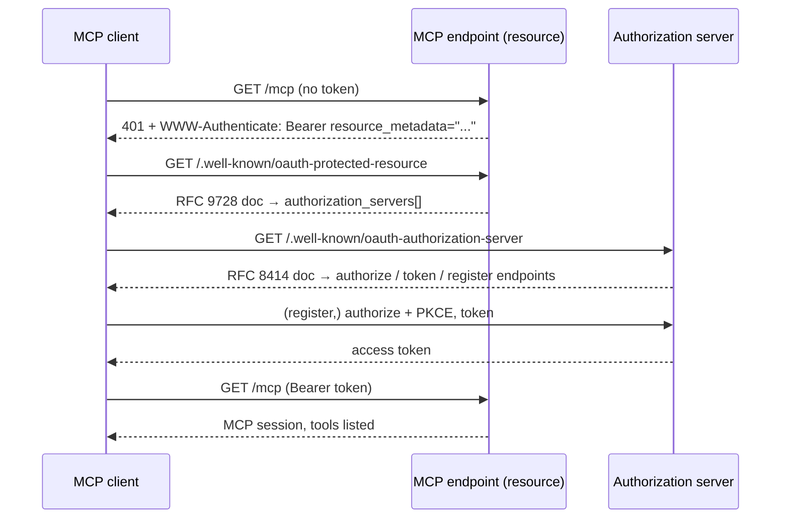

# OAuth discovery chain

The number-one reason a remote MCP server "won't connect" is not that it's down — it's that a client hitting it unauthenticated gets a dead-end response instead of a machine-followable pointer to where auth starts. The fix is a three-hop discovery chain: a `401` carrying `WWW-Authenticate: Bearer resource_metadata=...`, a protected-resource metadata document (RFC 9728), and an authorization-server metadata document (RFC 8414). Every hop is testable with curl in under a minute, and you should test all three before blaming any client.

## Why the failure is silent

An MCP client adding your server has no session and no token. Its only move is to hit your endpoint unauthenticated and follow whatever the response tells it. If the response is a bare `401`, a `403`, or — worse — a `200` because the endpoint is accidentally open, there is nothing to follow. The client reports "cannot connect" or "authentication failed" with no further detail, the user shrugs and removes the server, and nothing in *your* logs looks wrong: the endpoint answered every request it received. That's what makes this the #1 silent failure — both sides look healthy while the handshake never starts.



## The three hops

### Hop 1 — `401` with a `resource_metadata` pointer

An unauthenticated request to the MCP endpoint must return `401 Unauthorized` with a `WWW-Authenticate: Bearer` header whose `resource_metadata` parameter points at the protected-resource document:

```text
HTTP/1.1 401 Unauthorized
WWW-Authenticate: Bearer resource_metadata="https://app.customdomain.ai/.well-known/oauth-protected-resource"
```

Optionally include `scope="..."` so clients know what to request. This header is the entry point of the entire chain — without it, hops 2 and 3 may as well not exist, because no client will ever find them.

### Hop 2 — Protected Resource Metadata (RFC 9728)

`/.well-known/oauth-protected-resource` on the resource host names the resource and points at its authorization server(s):

```json
{
  "resource": "https://app.customdomain.ai/mcp",
  "authorization_servers": ["https://auth.customdomain.ai"],
  "bearer_methods_supported": ["header"],
  "scopes_supported": ["mcp:read", "mcp:write"]
}
```

The `resource` value must be the exact endpoint URL you publish everywhere else — registry `remotes[].url`, manifest `endpoint`. Byte-for-byte.

### Hop 3 — Authorization Server Metadata (RFC 8414)

`/.well-known/oauth-authorization-server` on each listed authorization server exposes the endpoints the client will drive:

```json
{
  "issuer": "https://auth.customdomain.ai",
  "authorization_endpoint": "https://auth.customdomain.ai/authorize",
  "token_endpoint": "https://auth.customdomain.ai/token",
  "registration_endpoint": "https://auth.customdomain.ai/register",
  "response_types_supported": ["code"],
  "grant_types_supported": ["authorization_code", "refresh_token"],
  "code_challenge_methods_supported": ["S256"]
}
```

Two details that matter in practice, per the MCP authorization spec (documented behavior): clients expect **PKCE** (`S256`), and most expect **dynamic client registration** via `registration_endpoint` — if you don't offer DCR, every client needs manually provisioned credentials, which in agent-land means most connections never happen.

## Test the chain end-to-end with curl

Run these three commands against your production endpoint. Do this *before* touching client configs, and again after every auth-layer deploy:

```bash
# Hop 1: unauthenticated hit MUST be 401 and MUST carry resource_metadata.
curl -si https://app.customdomain.ai/mcp | grep -i -E 'HTTP/|www-authenticate'
#   expect:  HTTP/1.1 401 ...
#            WWW-Authenticate: Bearer resource_metadata="https://.../.well-known/oauth-protected-resource"

# Hop 2: the protected-resource doc resolves to valid JSON naming authorization_servers[].
curl -s https://app.customdomain.ai/.well-known/oauth-protected-resource | python3 -m json.tool

# Hop 3: the auth server's metadata resolves with authorize/token endpoints.
curl -s https://auth.customdomain.ai/.well-known/oauth-authorization-server | python3 -m json.tool
```

Pass criteria: hop 1 shows the header with a `resource_metadata` URL; hops 2 and 3 return HTTP 200 with parseable JSON (if `json.tool` errors, you're serving HTML — usually a login page or a 404 page — where JSON must be).

## The real proof: connect an actual client

Three green curls are necessary but not sufficient — curl doesn't exercise registration, PKCE, redirects, or token exchange. The only proof the chain is walkable is a real MCP client completing it:

```bash
# Claude Code, HTTP transport — the client discovers auth via the chain above:
claude mcp add --transport http --scope user customdomain https://app.customdomain.ai/mcp
claude mcp list   # 'customdomain' should show connected; tools appear as mcp__customdomain__*
```

You know it worked when the client walks 401 → protected-resource → auth-server → (register) → authorize → token → session, and **lists your tools**. Test with a second client (Claude Desktop, Cursor, or another agent runtime) if your users span ecosystems — client implementations differ in strictness.

## Common breakages

Every one of these presents to the user as the same useless symptom — "cannot connect" — which is why you diagnose with the curls, in hop order:

| Breakage | What the client sees | Fix |
|---|---|---|
| Endpoint returns `200` unauthenticated | Accidentally open server; some clients connect with no auth, others reject the ambiguity | Gate the endpoint; return 401 with the header |
| Bare `403` (WAF, proxy, or app firewall) | Dead end — 403 carries no discovery pointer | Return 401 + header from the app; ensure the WAF isn't intercepting (see [Rendering, WAFs, and bot challenges](../technical/rendering-and-waf.md)) |
| `401` without `WWW-Authenticate` | Dead end | Emit the header with `resource_metadata` |
| Header present but no `resource_metadata` param | Client can't locate the metadata doc | Add the param with the absolute URL |
| Hop 2 or 3 returns 404 / HTML / redirect-to-login | Chain breaks mid-walk | Serve the well-known docs unauthenticated, as JSON, at the exact paths |
| `resource` ≠ actual endpoint URL | Strict clients reject the token audience | Make the values byte-identical across all surfaces |
| No `registration_endpoint` | Clients that require DCR can't obtain credentials | Implement dynamic client registration, or document manual setup prominently |
| Metadata says one transport, endpoint speaks another | Session negotiation fails after auth succeeds | Align `streamable-http` vs `sse` everywhere ([Manifests and DNS-AID](manifests-and-dns.md)) |

## Gotchas

- **"The endpoint is up" is not "the endpoint is connectable."** Uptime monitors and health checks all pass while the discovery chain is broken. Add the three curls to your deploy checklist or synthetic monitoring — it's the only check that measures what clients actually experience.
- **Don't debug the client first.** In our experience nearly every "your MCP won't connect" report against a hosted server traces to hop 1. Run the curls before reading a single line of client logs.
- **The well-known docs must themselves be reachable unauthenticated.** A depressingly common failure: the app's auth middleware protects `/.well-known/*` too, so the chain 401s on the documents that exist to escape the 401.
- **Keep the chain consistent with the other surfaces.** The `resource`, endpoint URL, and transport declared here must match your [registry listing](mcp-registry.md) and [capability manifest](manifests-and-dns.md) exactly. Mismatches don't error; they just never connect.
- **Re-verify after auth-stack changes.** Auth providers and reverse proxies get reconfigured; a chain verified in June can be broken by an unrelated middleware change in July. Cheap to re-run, expensive to discover via user churn.

## Related

- [The MCP Registry](mcp-registry.md) — being findable, the step before being connectable
- [Manifests and DNS-AID](manifests-and-dns.md) — pre-connect introspection and the byte-identical rule
- [Tool descriptions that rank](tool-descriptions.md) — what the agent evaluates once the session opens
- [Rendering, WAFs, and bot challenges](../technical/rendering-and-waf.md) — the infrastructure that silently intercepts machine clients
- [Domains and DNS](../technical/domains-and-dns.md) — if auth lives on its own subdomain, its records live here
- Source skills: [mcp-server-discoverability](https://github.com/ever-just/agentskills/tree/main/skills/mcp-server-discoverability), [agent-discoverability](https://github.com/ever-just/agentskills/tree/main/skills/agent-discoverability)
