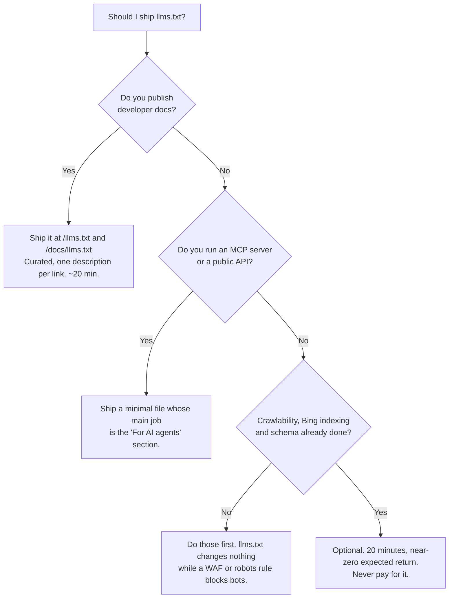

# llms.txt — the reality check

**Almost nothing reads your `llms.txt`. A server-log study across ~137k domains found ~97% of them receive zero bot requests, and Google has stated it does not use the file for Search, AI Overviews, or AI Mode.** It has exactly one real audience — coding agents pointed at a documentation site — and one genuinely load-bearing job: telling an LLM reading your human surface that an *agent* surface exists. This chapter gives you the evidence, the cheap-ship pattern for the case where it's worth doing, and a decision rule so you stop arguing about it.

## What llms.txt is supposed to be

The [llmstxt.org](https://llmstxt.org) proposal is simple and reasonable: publish a Markdown file at `/llms.txt` that acts as a curated index of your site for language models — an H1 with your name, a one-paragraph summary, then linked sections with a short description per link. An optional `llms-full.txt` concatenates the actual content so a model can ingest everything in one fetch.

It reads like `robots.txt` for LLMs. It is not. `robots.txt` is honored by crawlers because crawler operators chose to honor it. `llms.txt` has no comparable adoption commitment from any major model vendor.

## What the data says (as of 2026-07)

| Claim | Evidence | Tier |
|---|---|---|
| ~97% of llms.txt files get **zero** bot requests | Ahrefs server-log study across ~137k domains | External research |
| Google does **not** use llms.txt for Search, AI Overviews, or AI Mode | Public statement from Google's Gary Illyes, 2025-07-23; John Mueller separately called the SEO case speculative | Documented |
| No primary evidence that ChatGPT, Claude, or Perplexity read a *third-party* llms.txt at inference time | Our own research pass, 2026-07 — no vendor documentation, no reproducible test | Verified-by-us (negative result) |
| Coding agents (Claude Code, Cursor, and similar) *do* fetch docs-site llms.txt when pointed at it | Observed in our own agent sessions, 2026-07 | Measured |

The distinction that resolves most of the confusion: **publishing is trivial; consuming is what matters.** Anyone can serve the file in five minutes. The question is who requests it — and the answer, empirically, is almost no one, except coding agents working against documentation.

!!! warning "If someone is selling you llms.txt as 'AI SEO'"
    Ask them for request logs showing AI bots fetching the file, and for a citation lift attributable to it. We have never seen either. The paid-package version of this is on the [snake-oil list](geo-fundamentals.md#what-not-to-buy).

## Where it *is* real

Three cases where we still ship it, none of which are chat-citation plays:

**1. A documentation site read by coding agents.** This is the genuine use. An agent told "integrate the X API" and given your docs domain will fetch `/llms.txt` (or `/docs/llms.txt`) and use it to navigate. Quality matters here in a way it doesn't elsewhere: a bare link list scores poorly; per-link one-line descriptions are what make it navigable.

**2. Signposting your agent surface from your human surface.** This one is load-bearing and easy to miss. If you run an MCP server or a public API, an LLM reading your marketing site has no way to discover it — the endpoints, the registry name, the token URL, and the runbook exist nowhere in the human-readable HTML. A `## For AI agents` section in llms.txt is a cheap bridge. On customdomain.ai this was logged as a critical audit finding (2026-07-15): the marketing llms.txt never mentioned the MCP server even though the homepage advertised it.

**3. A curated product summary you control.** The file is a place to state, in your words, what you are and who it's for — the same grounding facts that make [the Ask-AI widget](ask-ai-widget.md) work. Low cost, non-zero option value if adoption ever changes.

## The cheap-ship pattern

Twenty minutes, then leave it alone. Curated, factual, kept in sync with the site — never auto-generated from a CMS page list, which produces a near-worthless dump (measured on one of our own tenants, 2026-07).

```markdown
# Example Product

> One-paragraph, factually accurate answer to "what is this": what it does,
> who it is for, and the one capability that distinguishes it. No slogans.

## Key facts
- Category: managed custom domains for SaaS platforms
- Deployment: hosted API and self-hostable (Apache-2.0)
- Pricing: published at https://example.com/pricing

## Documentation
- [Quickstart](https://example.com/docs/quickstart): connect your first domain in ~10 minutes.
- [API reference](https://example.com/docs/api): every REST endpoint, with request and response examples.
- [Guides](https://example.com/docs/guides): task-shaped walkthroughs for common integrations.

## For AI agents
- MCP endpoint: https://mcp.example.com/mcp (streamable HTTP)
- Registry name: com.example/mcp — listed in the official MCP Registry
- Auth: OAuth 2.0; discovery starts at /.well-known/oauth-protected-resource
- Agent runbook: https://example.com/docs/agent-runbook

## Company
- [About](https://example.com/about)
- [Contact](https://example.com/contact)
```

Rules that make the difference between useful and decorative:

- **One factual line per link.** The description is the whole value. A naked list of URLs teaches an agent nothing it couldn't get from your sitemap.
- **Absolute URLs**, so the file works when an agent has only the file contents.
- **Host-aware links.** If your marketing site and your app/docs live on different hosts, each host's llms.txt links to *its own* surfaces — a mistake we made and had to fix during a marketing/product host split (2026-07).
- **No fabrication.** Everything in the file must be true on the page it points at. The [honesty doctrine](../local/authenticity.md) applies to machine-readable files too.
- **Serve it as `text/plain` or `text/markdown` with a 200**, and keep it out of any auth wall.

### About `llms-full.txt`

Only ship it if it contains real content. The failure we found in our own stack (2026-07-15): a docs site's `llms-full.txt` emitted raw React JSX for all 47 API-reference pages — structurally valid, semantically useless, and actively misleading to any agent that read it. If your framework can't render the file to clean Markdown, skip it; a good `llms.txt` with descriptions beats a broken full dump.

## The decision rule



Stated plainly: **docs site → yes. Agent surface → yes, for the signpost. Marketing site only → optional hygiene, do it last, expect nothing.** And in every branch, if you haven't verified [AI crawler access](ai-crawlers.md) and [Bing indexing](../bing/index.md), those come first — they are the levers that actually gate citations.

## How you know it worked

There is no citation metric to check, so verify the mechanical facts and set expectations honestly:

```bash
# 1. It serves, as text, at the expected paths.
curl -sS -o /dev/null -w '%{http_code} %{content_type}\n' https://example.com/llms.txt
curl -sS -o /dev/null -w '%{http_code} %{content_type}\n' https://example.com/docs/llms.txt

# 2. Every link in it resolves (a docs index full of 404s is worse than none).
curl -s https://example.com/llms.txt | grep -oE 'https://[^ )]+' | sort -u \
  | while read -r u; do printf '%s %s\n' "$(curl -s -o /dev/null -w '%{http_code}' "$u")" "$u"; done

# 3. Who actually requested it? (expect near-zero — that is the finding, not a bug)
grep -c "llms.txt" access.log
```

Then the real test: point a coding agent at your docs domain and ask it to do a task from your quickstart. If it navigates using the file, it's doing its job. If it ignores the file and crawls your HTML instead, that's also fine — and a reminder that [crawlable, server-rendered docs](../technical/rendering-and-waf.md) are the thing that actually matters.

## Gotchas

- **Shipping llms.txt *instead of* fixing crawlability.** The most expensive version of this mistake: a site behind a bot challenge with a beautiful llms.txt that no bot can fetch. Fix the gate first ([AI crawlers](ai-crawlers.md), [Rendering and WAFs](../technical/rendering-and-waf.md)).
- **Auto-generating it from the CMS page list.** Produces an undescribed URL dump. Curate or don't bother.
- **`llms-full.txt` full of framework markup.** Verify the rendered bytes, not the route's existence.
- **Naming "llms.txt" inside a prompt you hand to an assistant.** Telling ChatGPT to "read our llms.txt" makes it *search* for the string, and the results are articles about the file format, not your company. This broke a real deep-link prompt of ours (2026-07-10) — the fix is in [the Ask-AI widget chapter](ask-ai-widget.md#the-self-contained-prompt-rule).
- **`/.well-known/ai-plugin.json`.** The old ChatGPT-plugin manifest is dead; don't resurrect it. The live agent-discovery surfaces are the [MCP registry](../agents/mcp-registry.md), the [OAuth chain](../agents/oauth-discovery.md), and [capability manifests](../agents/manifests-and-dns.md).
- **Letting it rot.** A stale llms.txt describing last year's product is worse than none, because the one audience that reads it will believe it. Fold it into the same review pass as your docs.
- **Confusing it with Google's Open Knowledge Format (OKF).** OKF is a 2026 Google Cloud Markdown spec for feeding knowledge to *your own* internal agents. It is unrelated to indexing, external discovery, or llms.txt (documented).

## Related

- [GEO fundamentals](geo-fundamentals.md) — the prioritized lever list this file sits at the bottom of
- [AI crawlers and crawlability](ai-crawlers.md) — the lever that actually gates citations
- [Content that gets cited](content-that-gets-cited.md) — what to build instead
- [The MCP Registry](../agents/mcp-registry.md) — the real machine-discovery surface for a product API
- [GitHub as a discovery surface](../agents/github-as-discovery.md) — where `AGENTS.md` (which agents *do* read) belongs
- [Templates](../appendix/templates.md) — a copy-paste llms.txt starter
- Source skills: [local-business-aeo-schema](https://github.com/ever-just/agentskills/tree/main/skills/local-business-aeo-schema), [generative-engine-optimization](https://github.com/ever-just/agentskills/tree/main/skills/generative-engine-optimization)
