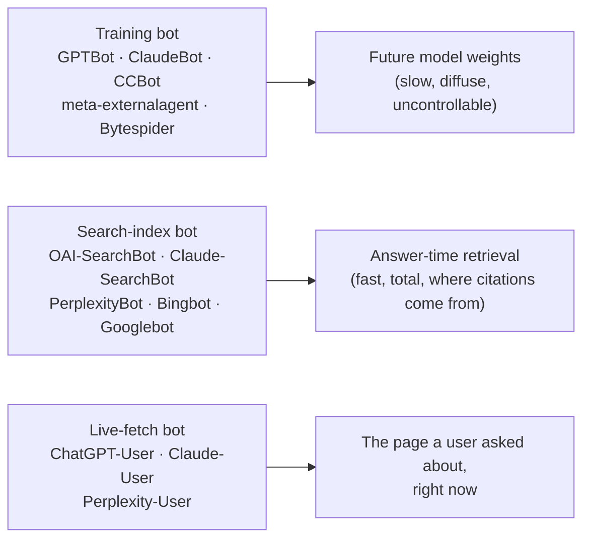

# AI crawler registry

The lookup table for every bot that matters to discovery: who operates it, what your content feeds when it fetches, whether it honors robots.txt, how to prove a request claiming to be it really is, and the exact token to write in a `User-agent:` line. Use it when you're authoring robots rules, reading access logs, or debugging why an answer engine won't cite you. The roster below is current **as of 2026-08** and every row is labeled by evidence tier — vendors rename and add tokens constantly, so re-verify quarterly against operator docs.

Reference sources this page distills: the [AI crawlers chapter](../ai-search/ai-crawlers.md) (policy and trade-offs), [Rendering, WAFs, and bot challenges](../technical/rendering-and-waf.md) (what to do when a bot is blocked), and [Templates §4](templates.md) (the robots.txt allow-list to copy).

## How to read the table

- **Evidence tier** — <span title="operator-documented">**V**</span> = the operator documents this in its own crawler docs. <span title="community-reported">**C**</span> = community- or third-party-reported; treat as a working assumption, never as a guarantee.
- **Feeds** — which of the three functional classes the bot serves: **training corpus**, **search index**, or **live user-initiated fetch**. This is the field that determines what you lose by blocking it.
- **Token** — the string to put after `User-agent:` in robots.txt. Matching is case-insensitive and matches the *product token*, not the full UA string.
- Two entries (`Google-Extended`, `Applebot-Extended`) are **robots tokens with no crawler behind them** — control switches for how already-fetched content may be used. Blocking them costs no crawl access.

## The registry

| Crawler | Operator | What it feeds | Honors robots.txt? | Verification method | robots.txt token |
|---|---|---|---|---|---|
| Googlebot | Google | Google Search index → organic results, **AI Overviews and AI Mode** | Yes (V) | Forward-confirmed reverse DNS to `*.googlebot.com` / `*.google.com`; published IP-range JSON | `Googlebot` |
| Google-Extended | Google | **Not a crawler.** Opt-out switch for Gemini app / Vertex grounding + training use of content Googlebot already fetched | Governs use, not fetching (V) | No UA, no IPs — nothing to verify | `Google-Extended` |
| Bingbot | Microsoft | Bing index → Bing results, **Copilot, and ChatGPT search** | Yes (V) | Forward-confirmed reverse DNS to `*.search.msn.com`; published IP-range JSON | `Bingbot` |
| GPTBot | OpenAI | Model **training** corpus | Yes (V) | Published per-bot IP-range JSON (`openai.com/gptbot.json`) | `GPTBot` |
| OAI-SearchBot | OpenAI | ChatGPT's **search index** — the retrieval layer behind ChatGPT citations | Yes (V) | Published per-bot IP-range JSON (`openai.com/searchbot.json`) | `OAI-SearchBot` |
| ChatGPT-User | OpenAI | **Live fetch** when a user's chat needs your page right now (pasted URL, deep link, browsing step) | Yes (V) | Published per-bot IP-range JSON (`openai.com/chatgpt-user.json`) | `ChatGPT-User` |
| ClaudeBot | Anthropic | Model **training** corpus | Yes (V) | Published crawler IP list on Anthropic's site (fetch the current URL from its crawler docs) | `ClaudeBot` |
| Claude-SearchBot | Anthropic | Claude's **search index** — retrieval behind Claude's web citations | Yes (V) | Same published IP list | `Claude-SearchBot` |
| Claude-User | Anthropic | **Live fetch** on a user's request in a Claude conversation | Yes (V) | Same published IP list | `Claude-User` |
| PerplexityBot | Perplexity | Perplexity's **search index** | Yes (V) | Published IP ranges linked from Perplexity's bot docs | `PerplexityBot` |
| Perplexity-User | Perplexity | **Live fetch** for the query a user just typed | Vendor documents it as user-initiated and therefore **generally not governed by robots.txt** (V) | Same published IP ranges | `Perplexity-User` |
| Amazonbot | Amazon | Alexa answers and Amazon assistant/search surfaces (Alexa V; broader assistant grounding C) | Yes (V) | Reverse DNS to an Amazon-operated crawler domain, per Amazon's Amazonbot docs | `Amazonbot` |
| Applebot | Apple | Siri, Spotlight Suggestions, and Apple's search surfaces | Yes (V) | Reverse DNS to `*.applebot.apple.com` plus Apple's published IP list | `Applebot` |
| Applebot-Extended | Apple | **Not a crawler.** Opt-out switch for Apple foundation-model **training** use | Governs use, not fetching (V) | No UA, no IPs — nothing to verify | `Applebot-Extended` |
| CCBot | Common Crawl | The open Common Crawl corpus, which many model trainers ingest as a **training** input | Yes (V) | No first-party verification list published; UA + cloud-range origin only (C) | `CCBot` |
| Bytespider | ByteDance | **Training** corpus for ByteDance AI products | ByteDance publishes a token; third parties have repeatedly reported non-compliance and undeclared UAs — **contested** (C) | No published verification list; treat UA claims as unverifiable (C) | `Bytespider` |
| meta-externalagent | Meta | Meta AI **training** and grounding | Yes (V) | No per-bot IP JSON published as of 2026-08; Meta traffic is identifiable by its ASN via whois (C) | `meta-externalagent` |

Three rows deserve extra emphasis:

- **`Bingbot` is an AI crawler.** Bing's index feeds ChatGPT search and Copilot — external research put Bing-index presence and ChatGPT citation at roughly 87% correlation (compiled 2026-07, third-party). Give Bingbot Googlebot-level respect; see [Bing & Beyond](../bing/index.md).
- **`Google-Extended` does not remove you from AI Overviews.** AI Overviews and AI Mode ride the Search index that `Googlebot` builds. Blocking Google-Extended opts you out of Gemini-app training and grounding only (vendor-documented). Sites that block it hoping to disappear from AI Overviews have misread the token.
- **`Perplexity-User` and the robots question.** Perplexity documents this fetcher as user-initiated and outside normal robots governance; separately, a 2025 third-party report alleged undeclared crawling from Perplexity infrastructure, which Perplexity disputed. Both facts are relevant when you're deciding what to allow — neither is settled. Report, don't assume.

!!! warning "One group per bot — the specific group *replaces* the `*` group"
    Per the robots.txt standard, a crawler obeys exactly one group: the most specific `User-agent` match. Once you write `User-agent: GPTBot / Allow: /`, GPTBot stops reading your `User-agent: *` group entirely — including the `Disallow:` lines protecting your cart, admin, and faceted-search paths. If those paths must stay out of a specific bot's reach, repeat the `Disallow:` lines inside that bot's own group.

## The three functional classes

Every bot in the table falls into one of three classes, and the classes fail in completely different ways. This is the whole reason a per-bot roster exists instead of one "AI bots" switch.



**Training bots** build the corpus a future model is trained on. Blocking one costs you baseline brand knowledge in models released years from now — a real cost, but slow and diffuse, and never visible in this quarter's numbers.

**Search-index bots** build the retrieval index an assistant queries at answer time. Blocking one removes you from that assistant's citations, completely and within a crawl cycle. This is where nearly all AI citation traffic comes from today ([how AI finds and cites](../foundations/ai-retrieval.md)).

**Live-fetch bots** fetch one URL because a human just asked about it. Blocking one means that when a user pastes your URL — or clicks your own [Ask-AI widget](../ai-search/ask-ai-widget.md) — their assistant gets a 403 and answers from whatever else it can find, usually a competitor or a stale directory listing.

### Why "block training, allow search" is coherent

If your content *is* the product — paywalled journalism, licensed datasets, proprietary research — then `Disallow: /` for `GPTBot`, `ClaudeBot`, `CCBot`, `meta-externalagent` while allowing `OAI-SearchBot`, `Claude-SearchBot`, `PerplexityBot`, `Googlebot`, and `Bingbot` is a defensible, internally consistent position: *you may point people to my work; you may not absorb it*. The tokens exist precisely so that policy is expressible. Add `Google-Extended` and `Applebot-Extended` to the blocked set and the training opt-out is complete without costing a single crawl.

### Why blocking the live-fetch bot is almost never coherent

Blocking `ChatGPT-User`, `Claude-User`, or `Perplexity-User` protects nothing — the fetch is one page, initiated by one human who already wanted your page. What it destroys is the highest-intent moment you get: a prospect asking their assistant about *you*, by name, and being told the page couldn't be read. There's no dashboard for it and no error in your logs beyond a 403 you asked for. For most businesses, all three classes should be allowed; the per-class trade-off table lives in [AI crawlers and crawlability](../ai-search/ai-crawlers.md).

The failure mode we actually measured is the blunt version of all of this: a WAF challenge returning **HTTP 429 to `Googlebot`, `GPTBot`, and `PerplexityBot` alike** — including on `/robots.txt` itself — while the site loaded perfectly in a browser. `site:` showed zero indexed pages and the business's Facebook page outranked its own domain (measured, 2026-07; full account in [Rendering, WAFs, and bot challenges](../technical/rendering-and-waf.md)). One toggle blocked all three classes at once.

## Verify it yourself

Never assume a token in robots.txt equals access. Run the probe.

### The curl-as-bot pattern

```bash
SITE="https://example.com"

# Realistic UA strings — some edges match on the full string, not the token.
UAS=(
  "Mozilla/5.0 (compatible; Googlebot/2.1; +http://www.google.com/bot.html)"
  "Mozilla/5.0 (compatible; bingbot/2.0; +http://www.bing.com/bingbot.htm)"
  "Mozilla/5.0 (compatible; GPTBot/1.1; +https://openai.com/gptbot)"
  "Mozilla/5.0 (compatible; OAI-SearchBot/1.0; +https://openai.com/searchbot)"
  "Mozilla/5.0 (compatible; ChatGPT-User/1.0; +https://openai.com/bot)"
  "Mozilla/5.0 (compatible; ClaudeBot/1.0; +claudebot@anthropic.com)"
  "Mozilla/5.0 (compatible; Claude-SearchBot/1.0; +claudebot@anthropic.com)"
  "Mozilla/5.0 (compatible; PerplexityBot/1.0; +https://perplexity.ai/perplexitybot)"
  "Mozilla/5.0 (compatible; Amazonbot/0.1; +https://developer.amazon.com/amazonbot)"
  "Mozilla/5.0 (compatible; Applebot/0.1; +http://www.apple.com/go/applebot)"
  "CCBot/2.0 (https://commoncrawl.org/faq/)"
  "meta-externalagent/1.1"
)

for ua in "${UAS[@]}"; do
  name=$(printf '%s' "$ua" | grep -oiE 'googlebot|bingbot|GPTBot|OAI-SearchBot|ChatGPT-User|ClaudeBot|Claude-SearchBot|PerplexityBot|Amazonbot|Applebot|CCBot|meta-externalagent' | head -1)
  result=$(curl -sS -o "probe-$name.html" -w '%{http_code} %{size_download}' -A "$ua" "$SITE/")
  printf '%-18s %s bytes\n' "$name" "$result"
done
# Then LOOK at the bodies — a small one is a challenge page, an empty one is client-rendered.

# Crawl directives must be readable by the same UAs, or nothing else matters:
curl -sS -o /dev/null -w 'robots  %{http_code}\n'  -A "GPTBot/1.1" "$SITE/robots.txt"
curl -sS -o /dev/null -w 'sitemap %{http_code}\n'  -A "GPTBot/1.1" "$SITE/sitemap.xml"
```

### How to read the result

| What you see | What it means | What to do |
|---|---|---|
| **200** + full HTML (your visible copy is in the body) | Healthy. The edge admits this UA and serves real content. | Nothing. Spot-check that a key phrase and your JSON-LD are in the raw body. |
| **200** + a small body (a few KB) with "Just a moment", "Checking your browser", "Security Checkpoint" | A **challenge interstitial** served at 200 — the worst case, because status-code-only monitoring reports success. To a non-rendering fetcher, that checkpoint page *is* your site. | Treat as a block. [WAF chapter](../technical/rendering-and-waf.md). |
| **200** + near-empty body (`<div id="root"></div>`) | Client-side rendering. Most AI fetchers don't run JavaScript, so this is an empty page to them. | Server-render or prerender. [WAF chapter, Failure 2](../technical/rendering-and-waf.md). |
| **403** | Deliberate block — a WAF bot rule, a UA deny-list, or a datacenter-IP rule. Check whether it's UA-based (only bot UAs fail) or fingerprint-based. | Allow-list verified crawlers at the edge. |
| **429** (often with `Retry-After`, `x-vercel-mitigated: challenge`, or `cf-mitigated: challenge`) | Rate limit or blanket challenge mode. If robots.txt is also 429, crawlers can't even read your directives. | Turn off blanket challenge modes; widen limits for verified crawlers. |
| **503** under a burst but 200 sequentially | Fragile origin. Repeated 5xx teaches crawlers to back off and can get pages dropped. | Fix origin headroom; pace your own probes sequentially with backoff. |
| **Different bodies for different UAs at 200** | Cloaking, intentional or accidental. | Checksum each saved body, diff the ones that differ, and find the rule doing it. |

Two honesty caveats on this probe. Your curl is a **spoofed** UA, so a 403 may mean the edge correctly rejected *fake* Googlebot while admitting the real one — a strong warning, not proof. And some WAFs match on client fingerprint rather than UA (Cloudflare's bot-fight mode 403s `python-urllib` while allowing curl with a browser UA — measured, 2026-07). Confirm with ground truth: Search Console's URL Inspection live test, GSC Crawl Stats fetch-response codes, and your own access logs filtered to crawler UAs *and* their verified IP ranges.

### Testing a specific robots rule

To check what a given bot is actually permitted, fetch the live file and read the group that applies to it — remembering that its own group replaces `*`:

```bash
curl -sS "https://example.com/robots.txt?cb=$(date +%s)" | \
  awk 'BEGIN{IGNORECASE=1} /^user-agent:/{g=$2} g ~ /gptbot|\*/ {print g": "$0}'
```

The cache-buster matters: edge caches have served stale robots.txt on a public host while the corrected file was live on the origin, and `Cache-Control: no-store` did not defeat it (measured, 2026-07 — [Reverse proxies and CMS traps](../technical/reverse-proxy-cms.md)).

## Spoofing: the user-agent proves nothing

A User-Agent header is a self-declared string. Anyone can send `GPTBot`, and scrapers do it constantly — both to look legitimate and to inherit whatever allowances you granted the real bot. **Never make an allow/deny decision at the edge based on UA alone.** Two verification methods exist; use one before you trust or allow-list anything:

**1. Forward-confirmed reverse DNS** (Google, Bing, Apple, Amazon). Resolve the client IP to a hostname, confirm the hostname is in the operator's crawler domain, then resolve that hostname back and confirm it returns the same IP. Both directions are required — reverse records alone can be forged by whoever controls the IP's PTR.

```bash
IP=66.249.66.1
host "$IP"                              # → crawl-66-249-66-1.googlebot.com
host crawl-66-249-66-1.googlebot.com    # → 66.249.66.1   ✅ forward-confirmed
```

**2. Published IP-range lists** (OpenAI, Anthropic, Perplexity, and also Google and Bing). Each operator publishes machine-readable ranges — OpenAI serves a separate file per bot, which is exactly the granularity you want when your policy differs by class. Fetch them on a schedule; ranges change.

```bash
curl -s https://openai.com/searchbot.json | python3 -m json.tool | head -20
```

If neither method is available for a bot (`CCBot`, `Bytespider`, `meta-externalagent` as of 2026-08), you cannot verify it. Treat traffic claiming those identities as ordinary anonymous traffic: rate-limit it normally, and don't grant it edge exemptions.

The practical shortcut: managed WAFs (Cloudflare "verified bots", Vercel, AWS WAF Bot Control) maintain these verifications for you. Prefer their **verified-bot allow** categories over hand-rolled UA rules — a hand-rolled rule admits every liar and eventually trips a real crawler arriving from an unexpected range.

## Gotchas

1. **Allow-listing by UA string.** It admits every scraper wearing the costume and still blocks real crawlers from new ranges. Verify by rDNS or published IPs, or use your WAF's verified-bot category.
2. **A per-bot group silently dropping your `*` disallows.** Give `GPTBot` its own group and it stops obeying the `*` group entirely — cart, admin, and faceted URLs included. Repeat the disallows per group.
3. **Blocking robots.txt itself.** Inside a challenge or rate-limit rule, your directives are unreadable, and crawlers that can't read rules assume rather than obey. Keep `/robots.txt` and `/sitemap.xml` outside every block rule.
4. **A 200 that is a checkpoint page.** Status-code monitoring reports green while every crawler receives a JavaScript challenge with no title, no content, no schema. Check the body size and grep the body, not just the code.
5. **Blocking `Google-Extended` to reduce AI visibility.** It doesn't touch Search or AI Overviews. If that was your goal you blocked the wrong thing; if the goal was training opt-out, you blocked the right thing.
6. **Treating `Bingbot` as legacy SEO.** It is the retrieval layer behind ChatGPT search. Deprioritizing it deprioritizes your largest AI citation surface.
7. **Roster drift.** This table is dated 2026-08. Vendors add tokens (`Claude-SearchBot` and `OAI-SearchBot` are both younger than the training bots they sit beside) and rename them. Re-verify quarterly against operator docs; correct this page in place with a dated note rather than silently.
8. **Assuming a robots edit took effect.** Between your CMS and the crawler sit template caches, proxy caches, and CDN caches — and behind a Host-rewriting proxy the CMS may emit `Disallow: /` for reasons unrelated to what you typed. Always verify on the **public** host, cache-busted ([Reverse proxies and CMS traps](../technical/reverse-proxy-cms.md)).

## Related

- [AI crawlers and crawlability](../ai-search/ai-crawlers.md) — the policy chapter: allow-list pattern, log verification, blocking trade-offs
- [Rendering, WAFs, and bot challenges](../technical/rendering-and-waf.md) — what to do when a probe returns 403/429 or a challenge body
- [Templates](templates.md) — §4 is the copy-paste robots.txt built from these tokens
- [Sitemaps and robots.txt](../google/sitemaps-and-robots.md) — robots syntax, meta robots, and the noindex traps
- [How AI finds and cites](../foundations/ai-retrieval.md) — why the search-index and live-fetch classes gate citations
- [The 30-minute AI visibility audit](../playbooks/ai-visibility-30min.md) — this probe as a routine
- [Reverse proxies and CMS traps](../technical/reverse-proxy-cms.md) — when the robots.txt you wrote isn't the one served
- Source skills: [local-business-aeo-schema](https://github.com/ever-just/agentskills/tree/main/skills/local-business-aeo-schema), [generative-engine-optimization](https://github.com/ever-just/agentskills/tree/main/skills/generative-engine-optimization), [reverse-proxy-cms-indexing](https://github.com/ever-just/agentskills/tree/main/skills/reverse-proxy-cms-indexing)
