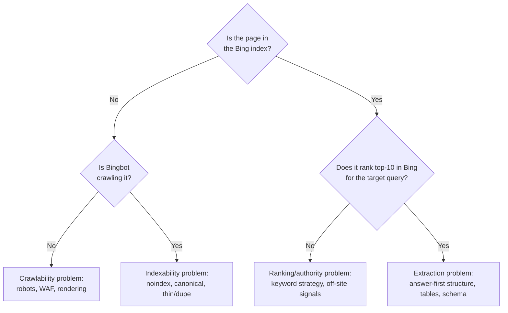

# Bing Webmaster Tools

**Bing Webmaster Tools (BWT) is the only console that shows you whether the index behind ChatGPT search and Copilot can see your site — and it takes about two minutes to set up if you already have Google Search Console.** This chapter walks the whole flow: sign-in, the import shortcut, the four verification methods and which one survives a rolling deploy, sitemap and URL submission with the quotas that actually apply, the handful of reports worth your time, and how to use Bing's data to debug "why does ChatGPT never mention us".

UI specifics below are marked *as of 2026* — Microsoft moves menus. The mechanics underneath (verification tokens, sitemap fetch, crawl reports) have been stable for years.

## Step 0 — know what a "site" means here

Unlike Search Console's Domain properties, BWT works in **URL-prefix terms**: `https://example.com/` and `https://docs.example.com/` are separate sites, each verified separately. As of 2026 there is no `sc-domain:`-style property that sweeps every subdomain.

Practical consequence: **add every host you actually publish on.** A marketing site on the apex and a docs site on a subdomain are two entries, two verifications, two sitemaps — and docs are frequently the pages AI answer engines cite. Skipping the docs host is the most common way a BWT setup ends up half-done.

## Step 1 — sign in

As of 2026, BWT accepts a **Microsoft, Google, or Facebook account** at sign-in. Pick the account that owns the business identity, not whatever is signed in on your laptop — the same account-hygiene rule as [Search Console](../google/search-console.md#gotchas). Getting this wrong means a later handover involves a support ticket.

## Step 2 — the fast path: import from Google Search Console

If the site is already verified in GSC, take the import. It is by far the fastest route:

1. On the BWT add-site screen, choose **Import from Google Search Console**.
2. Complete the Google OAuth consent for your GSC account.
3. Select the properties to bring across.

The import carries verification with it — imported sites arrive **already verified**, along with their sitemaps in most cases. Verify the result rather than assuming: open the site in BWT and confirm it shows as verified and that the sitemap list is populated.

**When the import doesn't work,** don't fight it. Causes we've seen and heard reported: the GSC property is a Domain (`sc-domain:`) property whose subdomain set doesn't map cleanly onto BWT's URL-prefix model; the signed-in Google account holds delegated-owner rather than full-owner permission; or the OAuth consent silently fails on a corporate account. Manual verification is five minutes — go do that instead of debugging an import.

## Step 3 — manual verification (and the one that breaks)

Four methods, as of 2026:

| Method | What you place | Best when | Failure mode |
|---|---|---|---|
| **XML file** | `BingSiteAuth.xml` at the site root | You control the web server / proxy | An app-route-served file **404s during deploys** — see below |
| **Meta tag** | `<meta name="msvalidate.01" content="…">` in every page's `<head>` | Your CMS has a verification field, or you inject sitewide | Only breaks if the whole site breaks — the most robust option |
| **CNAME record** | A DNS CNAME at a token-named host pointing at Bing's verification host | You control DNS and can't touch the site | DNS propagation delay; provider UIs that mangle long hostnames |
| **GSC import** | Nothing | Already verified in GSC | See Step 2 |

!!! warning "The verification file that flaps (shipped-and-verified, 2026-07)"
    On one production site the verification XML was served by a **CMS controller route**. Routes register only on a full application boot, so during rolling deploys the route briefly didn't exist and **Bing's verification fetch intermittently 404'd** — verification would take, then fail, with nothing wrong in the site itself.

    Two fixes, both applied: (1) also inject the `msvalidate.01` **meta tag sitewide** as a redundant second method — Bing accepts either; (2) for the bulletproof version, serve the file from the **proxy layer** with an exact-match location that returns the content directly, so it is immune to application restarts:

    ```nginx
    location = /BingSiteAuth.xml {
        default_type application/xml;
        return 200 '<?xml version="1.0"?><users><user>YOUR-TOKEN-FROM-BWT</user></users>';
    }
    ```

    The general rule for any root verification file: **root files belong to the layer that owns the public host**, not to the application behind it. Same lesson as the [reverse-proxy trap catalog](../technical/reverse-proxy-cms.md) — and the same reason the [IndexNow key file](indexnow.md#step-2-host-the-key-file) is served there too.

**Ship verification twice.** Belt-and-braces here costs nothing: file *and* meta tag. We did exactly that (2026-07-11) after the flapping incident, and verification has been stable since.

**How you know it worked:** the site shows **Verified** in BWT and the dashboard begins populating within a day or two. Independently, confirm the artifact from outside:

```bash
curl -sS "https://example.com/BingSiteAuth.xml?cb=$(date +%s)"
curl -sS "https://example.com/" | grep -i 'msvalidate'
```

Fetch the **public** host, cache-busted. A verification file that only exists on an internal host verifies nothing.

## Step 4 — submit the sitemap

**Sitemaps → Submit sitemap**, with the absolute URL (`https://example.com/sitemap.xml`). Bing also discovers sitemaps from the `Sitemap:` line in robots.txt, so keep that line correct and pointed at the **public** host — see [Sitemaps and robots.txt](../google/sitemaps-and-robots.md).

Sitemap submission is **uncapped**: submit the index, submit child sitemaps, resubmit after every publishing wave. Watch the discovered-URL count as an execution ledger — if you shipped 15 pages and the count didn't move, you have a [stale sitemap cache](../technical/reverse-proxy-cms.md#the-cache-stack-that-eats-your-fixes), not a Bing problem.

## Step 5 — URL submission, and the quotas that matter

BWT accepts direct URL submission (single or bulk) from a verified site. The quotas differ wildly by channel, and knowing which is which stops you from wasting the scarce one:

| Channel | Practical cap (as of 2026-07) | Use it for |
|---|---|---|
| **IndexNow** | Effectively uncapped (10,000 URLs per request per spec) | **Everything.** Wire it once, stop thinking about submission → [IndexNow](indexnow.md) |
| **Sitemap submission** | Uncapped | Full-site discovery, every publishing wave |
| **Bing Webmaster URL submission API** (`SubmitUrlbatch`) | **50 URLs/day** on the site we measured | A small priority set only |
| **BWT UI "Submit URL"** | Per-site daily allowance shown in the UI | One-off pushes of a fixed page |

Daily allowances vary by site age and standing, so **read the number the UI shows you** rather than trusting any figure from a blog post — including this one.

### API access (and why you probably don't need it)

The Bing Webmaster API key comes from **Settings → API Access** on an already-verified site. It cannot be generated any other way. We watched a submission script fail with `InvalidApiKey` because the key it was handed didn't come from that screen at all — the fix was generating a real one, and the deeper fix was realizing the call was redundant: **IndexNow already feeds Bing, uncapped.** Reach for the Webmaster API only when you need something IndexNow can't do — keyword research, report pulls, or programmatic verification status.

One documented quirk if you do use it: the keyword-research call (`GetKeyword`) expects **ISO `YYYY-MM-DD` dates**, not the `/Date(ms)/` format that older Microsoft API docs and samples show. Passing the legacy format returns empty results rather than an error.

## The reports worth reading

BWT has more panels than it has value. These five earn their time:

**AI Performance** — the reason this console is in the book. It breaks out impressions and clicks originating from **Copilot and Bing's AI surfaces**, which no other first-party console gives you: Google doesn't break out AI Overviews as of 2026-08, and OpenAI publishes no publisher console at all. If you are doing [GEO work](../ai-search/index.md), this is the closest thing to a scoreboard that isn't a manual prompt battery.

**Search Performance** — clicks, impressions, CTR, average position on Bing. Read it as *the queries Bing associates with you* — which is a decent proxy for the queries ChatGPT's retrieval step will run and find you on. Bing's absolute traffic will look small (it's a few percent of Google's); the query mix is what you're reading it for.

**URL Inspection** — Bing's per-URL verdict: is it indexed, when was it crawled, what did Bing see. The direct analogue of GSC's URL Inspection, and the fastest answer to "is this specific page in the index that grounds ChatGPT?"

**Site Explorer / Index Explorer** — the crawled-and-indexed tree by folder. Excellent for spotting a whole section missing (a docs subdirectory, a service-area folder) rather than a single bad page.

**Crawl information / SEO reports** — crawl errors, blocked-by-robots URLs, and on-page issue lists. The blocked-by-robots view is the one to check first after any infrastructure change; it is where a [`Disallow: /` served to bots](../technical/reverse-proxy-cms.md) shows up as an unambiguous number.

Skip, or at least deprioritize: the backlink panel (directional at best) and the site-scan tool (it duplicates what a proper crawl gives you).

## Using Bing data to debug ChatGPT visibility

"ChatGPT never mentions us" is not one problem — it's three, and BWT tells them apart in about ten minutes. Work the ladder in order:



1. **Is it indexed?** URL Inspection in BWT, plus a `site:example.com` search on Bing itself. Zero pages is a technical emergency, not a content problem.
2. **Is Bingbot crawling?** Crawl information. Crawled-but-not-indexed and never-crawled are entirely different diagnoses — exactly as in [GSC](../google/search-console.md#url-inspection-api-the-ground-truth-diagnostic). Never-crawled points at robots.txt, a [WAF bot challenge](../technical/rendering-and-waf.md), or an unreachable sitemap.
3. **Do you rank on Bing for the query you want cited on?** Search Performance. If you're at position 40, no answer engine is going to retrieve you — that's a [keyword strategy](../google/keyword-strategy.md) and [off-site signals](../ai-search/offsite-signals.md) problem, and it's slow.
4. **Ranking well but still never cited?** Now it's an *extraction* problem: the retrieved page isn't quotable. Front-load a direct answer, add a comparison table, mirror the on-page Q&A in schema → [Content that gets cited](../ai-search/content-that-gets-cited.md).
5. **Cross-check with the AI Performance report.** Copilot citations moving while ChatGPT stays silent tells you retrieval works and the gap is model- or prompt-specific; both flat tells you the problem is upstream at step 1 or 2.

!!! tip "A second route into Bing: public repositories"
    Bing crawls public GitHub repositories aggressively, and repo content has been observed reaching ChatGPT search through that path (reported/observed, not measured by us). If your docs are trapped behind a rendering problem you can't fix quickly, publishing a clean public docs repository is a legitimate parallel road into the same index — see [GitHub as a discovery surface](../agents/github-as-discovery.md).

## Gotchas

- **Verified in GSC ≠ verified in Bing.** They are separate consoles with separate tokens. The import is a convenience, not a link — if you later re-verify one, check the other.
- **Only the apex verified, docs subdomain forgotten.** BWT is URL-prefix scoped. Docs and app subdomains are often the pages AI cites; verify them too.
- **A verification file served by an application route flaps on deploy.** Serve root files at the proxy, and add the meta tag as a redundant method.
- **Verifying against an internal hostname.** Behind a Host-rewriting proxy, always fetch the artifact on the **public** domain before trusting it. Everything in the [reverse-proxy trap catalog](../technical/reverse-proxy-cms.md) applies to verification files.
- **Chasing the Webmaster API key from the wrong place.** It exists only under Settings → API Access on a verified site; anything else yields `InvalidApiKey`.
- **Burning the 50/day URL-submission quota on bulk work.** That's IndexNow's job. Save the quota for genuine priority pages.
- **Reading Bing's absolute traffic numbers as your market.** Bing is a small share of search. Read it for *index status, query mix, and AI citations* — those are the load-bearing signals — not for a traffic forecast.
- **Assuming an unverified property is fine because Google looks good.** You cannot observe Bing coverage, IndexNow reception, or Copilot citations without it. On a real audit this was graded the top leverage-per-effort fix on the whole property.

## Related

- [IndexNow](indexnow.md) — the push channel that makes URL-submission quotas irrelevant
- [Bing & Beyond](index.md) — why this console matters more than Bing's search share
- [Google Search Console](../google/search-console.md) — the sibling console and the import source
- [Sitemaps and robots.txt](../google/sitemaps-and-robots.md) — what you're submitting, and how it breaks
- [Reverse proxies and CMS traps](../technical/reverse-proxy-cms.md) — why root files and robots.txt lie to you
- [Auditing your AI visibility](../ai-search/ai-visibility-audit.md) — the prompt battery that pairs with the AI Performance report
- Source skills: [generative-engine-optimization](https://github.com/ever-just/agentskills/tree/main/skills/generative-engine-optimization) · [everjust-website-seo](https://github.com/ever-just/agentskills/tree/main/skills/everjust-website-seo) · [web-visibility](https://github.com/ever-just/agentskills/tree/main/skills/web-visibility)
