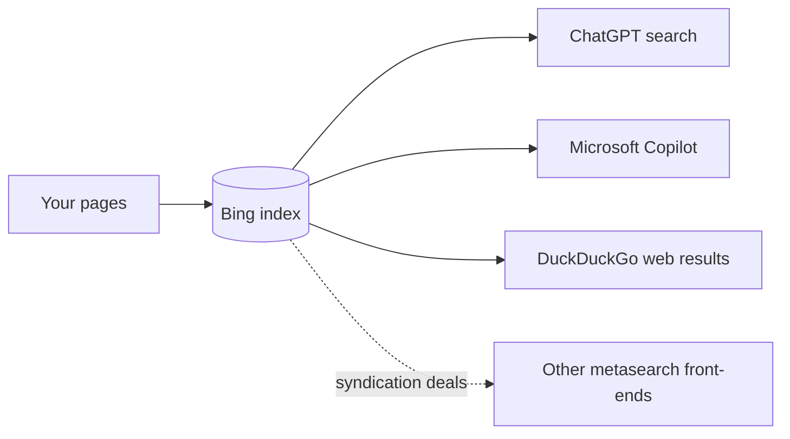

# Bing & Beyond

**Bing is the highest leverage-per-hour setup in this entire book — not because people search on Bing, but because ChatGPT and Copilot do.** Verifying a site in Bing Webmaster Tools takes minutes (less if you import from Google Search Console), wiring IndexNow takes an afternoon at most, and both are permanent. This part covers the whole surface: the console, the instant-submission protocol, and an honest accounting of the other engines that don't need chapters of their own.

## The effort-to-impact case

| Move | Effort | What it buys |
|---|---|---|
| Verify in [Bing Webmaster Tools](bing-webmaster-tools.md) | ~10 minutes (GSC import: ~2) | Visibility into the index that grounds ChatGPT search, plus a Copilot-citation report that exists nowhere else |
| Submit your sitemap there | ~1 minute | Bing discovers your pages instead of waiting to stumble on them |
| Wire [IndexNow](indexnow.md) | 30–120 minutes, once | Changed URLs pushed to Bing within minutes instead of days — and to Yandex, Seznam, and Naver for free |

Compare that against a month of content work with an unverified property and no way to see whether any of it reached the index that answer engines read. On one production SaaS audit (2026-07), an unverified Bing Webmaster Tools property was graded the **single highest leverage-per-effort gap on an otherwise strong deployment** — the team had shipped a schema graph, an MCP server, a full discovery layer, and still could not answer "is Bing seeing any of this?" The finding wrote itself: *running blind*.

## Who actually runs on Bing

- **ChatGPT search.** OpenAI's search grounding leans heavily on Bing alongside its own crawlers (`OAI-SearchBot`, `ChatGPT-User`). An independent analysis by Seer Interactive found roughly **87% of ChatGPT-search citations matched Bing's top organic results** — third-party research, not our measurement, but it matches everything we've observed. Google rank does *not* predict ChatGPT citations.
- **Microsoft Copilot.** Bing-native by construction. Copilot citations are the one AI surface with a first-party analytics report (see the [AI Performance report](bing-webmaster-tools.md#the-reports-worth-reading)).
- **DuckDuckGo.** Its web results have long been syndicated largely from Bing (DuckDuckGo runs its own crawler for some surfaces, but not a full web index). There's no DuckDuckGo webmaster console to submit to — **being in Bing is the lever.**
- **Other syndicating front-ends** buy results from Bing or Google rather than crawling. Syndication deals change; before assuming an engine is Bing-powered as of 2026, check its current provider. None of them offer a separate submission channel worth your time.

We watched this dependency bite directly. When an "Ask AI about us" deep link ([the Ask-AI widget](../ai-search/ask-ai-widget.md)) was tested on a young domain in 2026-07, ChatGPT did **not** fetch the URL in the prompt — it ran a *search*, via Bing, and returned nothing, because the site wasn't in Bing's index yet. Every clever AI-discoverability trick downstream of retrieval assumes Bing already has you.

## What's in this part

- **[Bing Webmaster Tools](bing-webmaster-tools.md)** — sign-in and the import-from-Search-Console shortcut, the four verification methods and which survives a rolling deploy, sitemap and URL submission with real quotas, the reports worth reading, and how to use Bing data to debug why ChatGPT never mentions you.
- **[IndexNow](indexnow.md)** — the push protocol: key file, API shape, which engines honor it as of 2026 (Google does not), the config-parameter-plus-cron enablement pattern from a production CMS, how to verify pings are received, and the honest limit — it accelerates discovery, it does not improve ranking.

## Beyond Bing: the engines that don't get a chapter

Three independent indexes exist outside the Google/Bing duopoly. Here's the honest triage as of 2026-08:

**DuckDuckGo — nothing to do.** No index of its own to submit to, no webmaster console, no crawl budget to manage. Fix Bing and DuckDuckGo follows. The only DuckDuckGo-specific work worth doing is confirming your pages actually render there after a migration, as a cheap second opinion on Bing's index.

**Brave Search — a genuinely independent index, but no console.** Brave built its own web index rather than syndicating, and it licenses that index through the Brave Search API, which has become a grounding source for several AI products (vendor-documented; we have not measured citation share from it). There is no submission tool and no verification flow: you get in by being crawlable, fast, and linked — the same fundamentals as everywhere else. If your [robots.txt is permissive](../ai-search/ai-crawlers.md) and your pages are server-rendered, you've done everything you can do. Don't spend hours here.

**Yandex — worth it only if you have a Russian-language or regional audience.** Its index is independent, it has a real webmaster console (Yandex Webmaster) with verification and sitemap submission, and it co-launched IndexNow with Microsoft, so **you get Yandex submission for free the moment you wire IndexNow** — no console required. Set up Yandex Webmaster only if the audience is real; otherwise the IndexNow ping is the entire correct investment.

**Seznam (Czech) and Naver (Korean)** are in the same bucket: independent regional indexes that honor IndexNow. Free coverage from one integration; dedicated effort only if you sell there.

The pattern: **one console (Bing) plus one protocol (IndexNow) covers every non-Google index that will ever matter to most operators.** That's why this part is three pages and not eleven.

## What Bing gives you that Google doesn't

Worth knowing even if you never plan to "optimize for Bing":

- **An AI-citation report.** The AI Performance view surfaces Copilot impressions and clicks. Google offers no equivalent breakout for AI Overviews as of 2026-08, and OpenAI offers no publisher console at all.
- **A push channel that actually works.** Google killed sitemap ping in 2023 and restricts its Indexing API to job postings and broadcast events. Bing takes IndexNow, all day, uncapped in practice.
- **Free directional keyword volume.** The Bing Webmaster keyword-research surface (and its API) returns query volume without a paid tool. It's Bing-scale — a few percent of Google's — so treat it as *relative* signal and cross-check absolutes elsewhere. On one SaaS it still corrected the roadmap: category terms like "[category] software" and "open source [category]" dwarfed "[brand] alternative" in demand.

## Related

- [How discovery works in 2026](../start/how-discovery-works.md) — the layer map this part sits inside
- [GEO fundamentals](../ai-search/geo-fundamentals.md) — why Bing indexing is lever #2 behind crawlability
- [How AI finds and cites](../foundations/ai-retrieval.md) — the retrieval mechanics that make Bing load-bearing
- [Google Search Console](../google/search-console.md) — the sibling console, and the property you'll import from
- [Launch a SaaS product](../playbooks/saas-launch.md) — where Bing setup slots into a launch sequence
- Source skills: [generative-engine-optimization](https://github.com/ever-just/agentskills/tree/main/skills/generative-engine-optimization) · [everjust-website-seo](https://github.com/ever-just/agentskills/tree/main/skills/everjust-website-seo) · [web-visibility](https://github.com/ever-just/agentskills/tree/main/skills/web-visibility)
