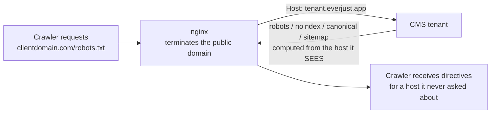

# everjust.app tenants — the multi-tenant CMS case study

everjust.app is a multi-tenant CMS platform: one application serving many businesses, each on its own public domain, behind an nginx reverse proxy that rewrites the `Host` header to an internal `*.everjust.app` machine host so the app can resolve which tenant database to serve. That single architectural decision — completely reasonable, invisible in the product, and shared by most hosted-CMS and white-label platforms — generated the most instructive indexing bugs in this entire corpus. This page is the dated record of finding them one incident at a time, on live client sites, between July and August 2026.

!!! abstract "What this proves"
    - **A Host-rewrite produces a bug *class*, not a bug.** The CMS decides robots.txt, `noindex`, canonicals, sitemap `<loc>`s, and `og:url` from the hostname it sees. Get that hostname wrong once and five discovery outputs go wrong at once — each with a different symptom, each individually plausible as "a weird CMS quirk."
    - **The CMS's own view of itself is not evidence.** Every incident here was correct in the database and wrong in the bytes the public domain served. The only reliable verification target is the live public URL, fetched from outside, cache-busted.
    - **Caches are the reason "I already fixed that" is false.** Compiled templates, a cached sitemap object, a proxy-level file cache, and a CDN each independently swallowed a correct edit during this window.
    - **Platform bugs need platform fixes.** Tenant-level vigilance failed within hours: a documented, freshly-fixed trap was re-triggered by a parallel workstream with a legitimate goal. If a field can noindex a live site, the fix belongs in the proxy or the platform code, not in an operator's memory.

## The architecture that caused all of it

The app is answering honestly for the host it was given. Only two layers can repair the mismatch: the proxy, which knows the real public host, or the app's configuration, which then has to survive the comparison the app performs. The full trap catalog and the nginx fixes live in [Reverse proxies and CMS traps](../technical/reverse-proxy-cms.md); this page is how they were found.

## Timeline

### 2026-07-02 — the tcstartupweek.com cutover (Vercel → CMS tenant)

The first domain moved onto a tenant, staged for near-zero downtime and executed in a fixed order: **TLS certificate issued first** via DNS-01 validation (before any traffic moved), then the nginx vhost added with Host handling wired so the tenant resolver still matched, then the registrar A-record flip, and only then the CMS's base-URL setting moved to the public domain. Rollback was planned before the flip and was one step: restore the two previous A records.

Two details that generalize to every cutover:

- **The mail zone was never touched.** DKIM CNAMEs, SPF, DMARC, and the bounce MX lived in the same zone as the web records and were deliberately left alone — a web cutover has no business editing the email identity. Campaign sending continued uninterrupted through the migration. ([Email trust](../technical/email-trust.md))
- **The base URL is a deliverability artifact too.** Until it moved, the tenant's campaign tracking and unsubscribe links were minting on the shared platform host rather than the brand domain. Link-domain mismatch is a trust and deliverability problem, not only a canonical one — check it on every cutover.

The platform-side certificate story was its own lesson: the box's system ACME client had been broken by a package-level library conflict, so certificate issuance moved to a DNS-validated client that then owned all renewals including the platform wildcard. Migrations surface infrastructure debt on a deadline.

### 2026-07-10 → 07-11 — the trap catalog opens

Work on a second tenant (the [customdomain.ai](customdomain-ai.md) marketing site) turned an unexplained AI-search failure into the platform's founding discovery bug.

!!! warning "robots.txt said `Disallow: /` on every tenant behind the rewrite"
    The CMS's robots template guards its output with a domain-match check: *if a domain is configured and the requesting host doesn't match it, assume this is a staging duplicate and emit `Disallow: /`*. Behind the Host rewrite, the requesting host is the internal machine host, so **the comparison can never succeed**. Every page returned 200; robots.txt told Googlebot, Bingbot, and every AI fetcher to leave. Fixed first with a template-level override forcing the clause off, later hardened into a static robots.txt served by the proxy so the CMS is no longer in the loop.

Three more members of the class fell out the same week:

- **The internal host was a fully crawlable duplicate of the whole site** — reachable on the platform's wildcard domain, complete with its own sitemap. Fixed with a dedicated proxy server block for that exact hostname adding `X-Robots-Tag: noindex, nofollow`, and deliberately **no redirect**: the machine host carries tenant routing, OAuth callbacks, webhooks, and links inside already-sent email. A 301 would have broken all of it. Admin aliases got the same treatment.
- **The sitemap and the robots `Sitemap:` line advertised the internal host**, because both are built from the request's URL root. Fixed at the proxy with a `sub_filter` rewriting internal → public — with `Accept-Encoding ""` set, because `sub_filter` cannot touch a compressed body and fails *silently* without it.
- **The CMS caches its rendered sitemap** as a stored attachment on roughly a 12-hour cycle, so new pages and domain changes don't appear until it expires. A scheduled job now clears that object every four hours, and the cutover checklist deletes it explicitly.

The same week, **IndexNow went from a per-site script to a platform feature**: the platform's visibility addon ships JSON-LD (Organization + WebSite with a search action), an `llms.txt` route, `security.txt`, and IndexNow behind a single config flag plus a scheduled job, so any tenant can turn on Bing/Yandex/Seznam/Naver push submission without bespoke work. First bulk submission from a tenant: 73 URLs, HTTP 202. What that buys is faster *discovery* — not ranking, and not citations. ([IndexNow](../bing/indexnow.md))

### 2026-07-18 — the second cutover, with the fixes baked in

A local-business tenant moved to its brand domain ([Heads Up](headsup.md)). By now the robots/sitemap/duplicate-host repairs were checklist items in the migration itself rather than post-hoc discoveries, and one boundary was written down in capitals: **the machine host stays live and is never redirected**. The cutover also proved the durability rule — proxy edits made only on the box are reverted by the next deploy, so the robots and sitemap blocks were only real once committed to the config's source of truth.

### 2026-07-19 — the view-routing trap

A schema block was injected into a tenant's homepage, verified present in the database, and never appeared in the rendered HTML.

!!! warning "It wasn't a cache. It was the wrong template entirely."
    The block survived a full application restart while the page stayed byte-identical across fetches. The root cause: the site's homepage setting pointed `/` at a *different page's* template than the one the tooling mapped to `url: "/"`. Correct markup sat, "verified", in a template that no longer served the route. The diagnosis that finally worked was a **distinctive-string test** — prove which template actually renders the route (marker absent, that page's own hero text present) before entertaining a single cache theory. Two nested traps en route: injecting into an editor-managed container that the renderer strips on the way out, and a write path that updates the stored template without invalidating warm workers' compiled copies. And one non-fix to remember: you cannot bust the cache by re-saving the page in the visual editor, because its sanitizer strips `<script type="application/ld+json">` on save.

The lesson that outlived the incident: much of the "you have to restart for edits to show" folklore on this platform traced back to **editing the wrong copy of a view** — copy-on-write templates can hold a module-owned original and a site-specific fork under one key, the fork renders, and edits to the original succeed silently with zero effect.

### 2026-07-29 — the eleven-day noindex, and the seconds-long relapse

!!! danger "One field, set for a good reason, noindexed an entire live site for 11 days"
    The same domain-mismatch check that produced `Disallow: /` also gates the page layout's `<meta name="robots" content="noindex">`. Setting the CMS's domain field during the 07-18 cutover — a normal, correct-looking thing to do — stamped `noindex` on every page of a live client site. Search Console's first programmatic pull, eleven days later, showed every page `Excluded by 'noindex' tag` with Google crawling and discarding daily. The fix was to clear the field; canonicals stayed correct because they fall back to the frozen base-URL setting.

    Hours later, a parallel workstream chasing a cosmetic wrong-host `og:url` **re-set the same field and re-noindexed the live public site**. It was reverted within seconds — but only because the first session had just documented the causal chain. Two rules came out of it: on a Host-rewriting platform the CMS's domain field is a loaded gun, and **canonical is the tag that governs indexing; `og:url` affects social previews only** and is never worth touching indexing controls for.

The same day produced three more platform findings, each a different flavor of "the public host serves different bytes than you think":

- **A proxy-level cache was serving a stale robots.txt on the public domain** while the machine host served the corrected file. `Cache-Control: no-store` and query-string busting did not defeat it. It needed a purge plus a cache-bypass rule for `/robots.txt` and `/sitemap*.xml` — scheduled into a maintenance window rather than applied unilaterally, because the proxy config is shared blast radius across every tenant.
- **A default `Disallow: /shop`** — sensible boilerplate meant to stop faceted-URL crawl waste — was hiding 14 real, sellable service pages on a client site. Nineteen sitemap URLs were robots-blocked in total: the sitemap was inviting Google to index URLs robots.txt forbade crawling. Rewritten to block only facets, cart, checkout, payment, and confirmation.
- **A platform route decorator kept every tenant's homepage out of its sitemap.** The platform's brand controller registers `/` with sitemap generation disabled, while the CMS core skips the `/` page record on the assumption that the route supplies it — so `/` fell through both paths. Blast radius was measured across all nine tenant databases before touching anything (four public-site tenants would gain the entry, five app-only tenants unchanged); the conditional fix was validated and staged for a maintenance window rather than shipped hot. Recorded alongside it, because reports kept conflating them: **sitemap omission does not block indexing** — the homepage was verified fully indexable throughout.

Also cataloged this week, as durable platform hazards: the proxy config is a single-file bind mount, so replacing the file changes its inode and the running process keeps reading the orphaned copy — validation and reload both report success against a stale config (one box ran a six-day-old config this way, detected by comparing inodes inside and outside the container). And the origin is small enough to return 503 under a handful of concurrent requests, which means verification sweeps must run sequentially with backoff, and crawlers that hit those 503s throttle their crawl of you.

### 2026-08-02 → 08-03 — the platform trust layer, designed and paused

The window closes on the platform domain itself rather than a tenant: a full DNS and email-trust remediation program for everjust.app was designed end to end, adversarially reviewed with a mandate to refute rather than confirm, and **deliberately paused before any production change** when the review returned a fail-as-written verdict — one proposed fix was wrong for the problem it was written for, and two changes would have silently dropped existing behavior. All three were corrected in the design; the apply step remained gated on owner approval at record end. The record is filed here because it is the honest outcome: designed, audited, not applied. ([Email trust](../technical/email-trust.md))

## The numbers

| Metric | Value | Date | Status |
|---|---|---|---|
| Sitewide `noindex` on a live client tenant | 11 days (2026-07-18 → 07-29) | 2026-07-29 | Measured |
| Relapse after the fix | Re-set and reverted within seconds by a parallel session | 2026-07-29 | Measured |
| Tenant databases on the platform at audit | 9 (4 public sites, 5 app-only) | 2026-07-29 | Measured |
| Sitemap URLs blocked by robots.txt on one tenant | 19 blocked, of which **14 real sellable pages** | 2026-07-29 | Measured |
| Sitemap growth after clearing the cached sitemap object | 80 → 93 URLs | 2026-07-29 | Measured |
| CMS sitemap cache TTL / mitigation | ~12 h; scheduled clear every 4 h | 2026-07-11 | Measured / shipped |
| Sitemap entries carrying `lastmod` on one tenant | 0 of 93 | 2026-07 | Measured (minor: affects re-crawl scheduling, not indexing) |
| Stale proxy config served after a file-replacement edit | 6 days | 2026-07 | Measured |
| First IndexNow submission from a tenant | 73 URLs, HTTP 202 | 2026-07-11 | Measured (submission ≠ ranking ≠ citation) |
| Compression on tenant HTML | gzip/brotli off platform-wide (~166–211 KB uncompressed HTML) | 2026-07 | Measured, open at record end |
| Origin behavior under concurrent probes | 503s under a handful of parallel requests | 2026-07 | Measured |

**Still unmeasured, honestly:** the traffic and indexing cost of the eleven noindexed days (no analytics existed on the affected site during the window); how many tenants across the fleet had been silently noindexed or `Disallow`-blocked before the class was understood — the exposed cohort was identified (any tenant with the domain field set) but no fleet-wide before/after was captured; whether the duplicate internal host had been indexed before the noindex header landed; and any effect of platform IndexNow on Bing coverage or ChatGPT citations, because Bing Webmaster Tools was unverified for these properties during the window.

## What worked

- **Fixing at the proxy instead of in the CMS.** Static robots.txt, sitemap `sub_filter`, and a dedicated noindex server block for the machine host removed the CMS from decisions it structurally cannot make correctly. Template-level overrides worked too, but survive only until the next platform update rediscovers them.
- **`X-Robots-Tag` instead of a redirect** for the crawlable internal host. The duplicate dropped out of indexes and nothing in the plumbing broke.
- **Measuring blast radius before shipping a platform fix.** Nine tenant databases were enumerated before touching a shared route decorator; the change was staged for a window rather than applied live.
- **Additive, backed-up, validated proxy edits.** New `server`/`location` blocks collide with nothing; validation before reload; restore-and-do-not-restart on failure. Zero tenant outages from config work in the window.
- **Turning per-site scripts into platform features.** IndexNow, sitewide JSON-LD, and `llms.txt` became a config flag rather than an engagement task — the only version of this work that scales past one client.
- **Writing the causal chain down where the next operator hits it.** That is the sole reason the noindex relapse lasted seconds instead of another eleven days.

## What failed

- **The domain field remained a loaded gun for the entire window.** The durable fix is platform-level; what shipped in the window was documentation plus tenant-level care, and it was re-triggered within hours.
- **Correct edits repeatedly did not serve.** Compiled templates, the cached sitemap object, a proxy file cache, and a CDN each swallowed a real fix. Time lost was spent almost entirely on cache theories that were wrong (the view-routing trap) or right for the wrong layer.
- **Defaults were trusted.** The `Disallow: /shop` boilerplate was never diffed against what the tenant's shop actually contained, and it hid money pages for weeks.
- **Box-only fixes evaporated.** Proxy edits that were not committed to the deploy source of truth were reverted by the next deploy, and the bind-mount inode trap let a box run days-old config while every command reported success.
- **Parallel sessions re-broke each other.** Two workstreams with legitimate, incompatible goals touched the same field. Coordination was documentation, not a lock.
- **Performance debt stayed open.** Compression off platform-wide and an origin that 503s under light concurrency are both crawl-budget problems; both were still open at record end.

## What we'd do differently

- **Ship the platform-level fix the first time the trap fires.** Every subsequent incident in this record is a repeat of a known root cause on a different tenant.
- **Add an automated fleet check.** A daily job fetching every tenant's public `/robots.txt` and homepage `<meta name="robots">` from outside would have caught all three headline incidents on day one, for a few lines of code.
- **Diff robots.txt against the sitemap and the actual catalogue** as a release gate, not as an audit finding.
- **Put "prove which template serves this route" at the top of the CMS debugging checklist**, ahead of every cache hypothesis.
- **Treat the CMS domain field as change-controlled** — the kind of setting that gets a comment in the config UI and a checklist entry, because its failure mode is invisible and total.

## Transferable lessons if you run behind a rewriting proxy

You do not need this platform to inherit these problems. Any hosted CMS, white-label builder, or multi-tenant app fronted by a proxy that rewrites `Host` will reproduce most of them.

1. **Enumerate what your CMS derives from the request host** — robots.txt, meta robots, canonical, `og:url`, sitemap `<loc>`, and any "is this my domain?" guard. That list is your exposure.
2. **Verify from outside, on the public domain, cache-busted, after every SEO-relevant change.** `curl -sS "https://yourdomain.com/?cb=$(date +%s)" | grep -i 'name="robots"'` and the same for `/robots.txt`. Never the editor preview, never the internal host, never the database row.
3. **Prefer the proxy for anything host-derived.** It is the only layer that knows the public host, and it is immune to app restarts, deploys, and CMS updates.
4. **Noindex the internal host; never redirect it.**
5. **Assume a cache between you and the truth** — and identify which one before re-editing anything.
6. **Fix it once, for every tenant.** On a platform, a per-site fix is a per-site liability.

## Chapters this case feeds

- [Reverse proxies and CMS traps](../technical/reverse-proxy-cms.md) — the full trap catalog and the nginx patterns, assembled here
- [Domain migrations](../technical/domain-migration.md) — the cutover order, the machine-host boundary, and preserving the email zone
- [Sitemaps and robots.txt](../google/sitemaps-and-robots.md) — the noindex traps and the robots-vs-sitemap contradiction check
- [IndexNow](../bing/indexnow.md) — platform-wide enablement and what submission does and does not buy
- [Email trust (SPF/DKIM/DMARC)](../technical/email-trust.md) — why a web cutover must leave the mail zone alone
- [Measurement and baselines](../foundations/measurement.md) — the Search Console pull that made the noindex visible
- [customdomain.ai](customdomain-ai.md) and [Heads Up Outdoor Services](headsup.md) — the two tenants where these traps were lived
- Source skills: [reverse-proxy-cms-indexing](https://github.com/ever-just/agentskills/tree/main/skills/reverse-proxy-cms-indexing), [everjust-website-infra-views](https://github.com/ever-just/agentskills/tree/main/skills/everjust-website-infra-views), [everjust-tenant-domain-migration](https://github.com/ever-just/agentskills/tree/main/skills/everjust-tenant-domain-migration), [everjust-website-seo](https://github.com/ever-just/agentskills/tree/main/skills/everjust-website-seo) — full mapping in the [skill index](../appendix/skills-index.md)

---

*Record window: 2026-07-02 → 2026-08-03. Open at close: the platform-level domain-field fix, the homepage-sitemap patch (validated, awaiting a maintenance window), the proxy robots/sitemap cache-bypass rule, platform-wide compression, and the paused domain/email remediation. Later developments will be appended below with dates; the record above stays as written.*
