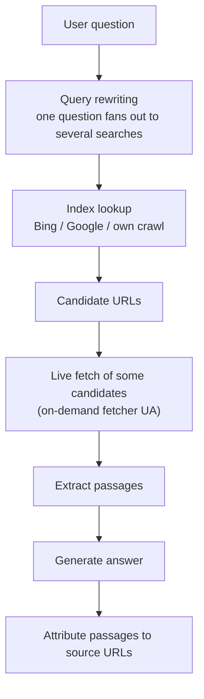

# How AI finds and cites

When an assistant names your product, that knowledge arrived by exactly one of three routes, and only two of them are things you can work on this quarter. This chapter goes underneath that: which index each major assistant leans on, what a "citation" is mechanically, and the distinction that decides most outcomes — **being indexed is not the same as being retrievable at answer time.** It closes with the evidence base, each number dated and labelled by how much weight it can bear.

## The three routes, in mechanical detail

| Route | Latency | Your control | How you verify |
|---|---|---|---|
| **Training data** | Months to years | Indirect (be present where corpora are built) | You can't, directly. Ask the model with search disabled and treat the answer as weak evidence. |
| **Search grounding** | Live, per query | High — this is the operational surface | Query the assistant and read the cited URLs |
| **User-supplied context** | Immediate | Total | Click your own deep link and watch what happens |

**Training data.** Your content, and content *about* you, was in the corpus when the model was trained. Slow, uncontrollable, biased toward old and widely-referenced sources. It's the reason off-site presence compounds: a Reddit thread, a GitHub README under a permissive license, a directory listing — these persist into corpora in a way a marketing page rewrite does not. You cannot ship this quarter; you can plant it.

**Search grounding.** The assistant issues one or more searches, gets back candidate URLs from an index, fetches some of them live, and writes an answer over what it read. This is where most citations come from today, and it means **classic crawlability and ranking gate AI visibility**. It is also the route with a second, separate gate that catches people out — see "Indexed is not retrievable" below.

**User-supplied context.** The user pastes your URL, uploads your doc, or arrives via a prefilled prompt link. You control this completely, which is why the [Ask-AI widget](../ai-search/ask-ai-widget.md) exists. One measured caveat from shipping that widget (2026-07-10): **a `?q=` deep link does not make ChatGPT fetch a URL — it makes it search.** If the site isn't in the index the assistant searches, the deep link produces nothing useful. Route 3 leans on route 2 more than it looks.

!!! note "A fourth surface that isn't retrieval at all"
    AI *agents* don't do any of the above. An agent looking for a capability consults registries and resolves discovery endpoints — a different mechanism with different plumbing. Content optimization does nothing for it and registry presence does nothing for chat citations. Keep the two programs separate: → [AI Agents](../agents/index.md).

## Which assistant leans on which index

As of 2026-07. This roster shifts; re-verify quarterly.

| Surface | Primary index | Own crawler(s) | Practical implication |
|---|---|---|---|
| **ChatGPT Search** | Bing, heavily | `OAI-SearchBot` (search index), `GPTBot` (training), `ChatGPT-User` (on-demand fetch) | Bing Webmaster Tools is a ChatGPT lever. Google rank is not. |
| **Google AI Overviews / AI Mode** | Google | Googlebot; `Google-Extended` controls AI training/grounding use | Ordinary Google indexing is the entry ticket |
| **Perplexity** | Own crawl plus partner indexes | `PerplexityBot` (index), `Perplexity-User` (on-demand fetch) | Independent of both majors; rewards freshness |
| **Claude** | Search partner plus own crawl | `ClaudeBot` (training), `Claude-SearchBot` (search index), `Claude-User` (on-demand fetch) | Allow all three tokens or you're picking which capability to lose |
| **Microsoft Copilot** | Bing | Bingbot | Same lever as ChatGPT: Bing |

The compressed version, and the single most under-priced fact in the field: **the Bing index is the cheapest AI-visibility asset most operators own and never claim.** Verifying a property in Bing Webmaster Tools takes minutes and is the only place to *observe* Copilot-side citation data. On a portfolio of seven properties we audited (2026-07-15), exactly one was verified in Bing — and the operator had been "running blind" on the AI-visibility question for weeks without realizing the instrument existed. → [Bing Webmaster Tools](../bing/bing-webmaster-tools.md)

## What a citation is, mechanically



Five things follow directly from this shape, and they explain most of the tactics in the [AI Search](../ai-search/index.md) part:

1. **The unit of citation is a passage, not a page.** A page that answers the question in a clean, self-contained block is quotable. A page whose answer is distributed across six paragraphs with "as mentioned above" references is not.
2. **You compete at the query-rewrite layer, not the query layer.** The assistant reformulates one human question into several machine searches. Owning the literal phrasings people use — including the awkward, problem-aware ones — is what puts you in the candidate set.
3. **Extraction format matters more than prose quality.** Structured blocks — tables, definition lists, question-shaped headings with the answer in the first sentence — survive chunking intact. Prose gets shredded.
4. **Position within the page matters.** The top of the document is disproportionately what gets extracted. Answer first; elaborate after.
5. **Being in the candidate set is not being cited.** The live fetch step in the middle of that diagram is a second gate — and the one people miss.

## Indexed is not retrievable

This is the chapter's load-bearing idea. Two distinct classes of bot exist, with different jobs and different robots.txt tokens:

| Class | Examples | When it runs | What blocking it costs you |
|---|---|---|---|
| **Index crawlers** | `OAI-SearchBot`, `PerplexityBot`, `Claude-SearchBot`, Bingbot, Googlebot | Ahead of time, on a schedule | You never enter the candidate set |
| **On-demand fetchers** | `ChatGPT-User`, `Claude-User`, `Perplexity-User` | At answer time, for this user's question | You're a candidate but the passage never loads — so you're not cited |
| **Training crawlers** | `GPTBot`, `ClaudeBot`, `CCBot`, `meta-externalagent` | Continuous | Long-term corpus presence only |

**A page can be perfectly indexed and still uncitable** because the on-demand fetcher gets a 403, a bot challenge, or an HTML shell with no content. On-demand fetchers respect robots.txt, and most execute little or no JavaScript. The failure is invisible from every dashboard you own: search rankings look fine, Search Console looks fine, and the assistant simply never mentions you.

**How you check (measured, cheap, decisive):**

```bash
for ua in "GPTBot/1.1" "OAI-SearchBot/1.0" "ChatGPT-User/1.0" \
          "ClaudeBot/1.0" "Claude-User/1.0" "PerplexityBot/1.0" \
          "Perplexity-User/1.0" "bingbot/2.0"; do
  code=$(curl -sS -o /tmp/probe -w '%{http_code}' -A "$ua" https://yourdomain.com/)
  words=$(sed 's/<[^>]*>//g' /tmp/probe | wc -w)
  printf '%-22s %s  %s words of text\n' "$ua" "$code" "$words"
done
```

You want `200` **and** a word count that reflects real content. A 200 with 40 words is a JavaScript shell — the same failure as a block, wearing a success code. We ran exactly this probe across a SaaS property and its docs host on 2026-07-15: all fetchers 200, real content, "verified clear — do not re-chase." That negative result was worth more than a week of speculative content work, because it moved the whole investigation off-site.

The inverse case, measured 2026-07-11 on a local-business domain: a hosting security mode returned **429 plus a challenge to Googlebot, GPTBot, and PerplexityBot**, including on `robots.txt` itself. One toggle had made the business invisible to search and AI simultaneously. → [AI crawlers](../ai-search/ai-crawlers.md), [Rendering and WAFs](../technical/rendering-and-waf.md)

## The evidence base

Everything below is dated and labelled. **Reported** = published third-party research we relied on but did not reproduce. **Measured (ours)** = we observed it directly on a property we operated. Nothing here is a guess, and where we haven't measured an outcome, it says so.

### Retrieval and citation behavior

| Claim | Number | Label | Date |
|---|---|---|---|
| ChatGPT citations correlate with Bing's index/top results | ~87% | Reported (research pass) | 2026-07 |
| Share of AI citations that are **third-party** sources, not the vendor's own site | ~85–93% | Reported | 2026-07 |
| Reddit's share of AI citations across major engines | ~40% | Reported | 2026-07 |
| Perplexity citations sourced from Reddit | ~47% | Reported | 2026-07 |
| Domains cited by **both** ChatGPT and Perplexity | only ~11% | Reported | 2026-07 |
| Perplexity re-crawl window for fresh content | 2–7 days | Reported | 2026-07 |
| Citations drawn from the **first 30%** of a page | ~44% | Reported | 2026-07 |

The 85–93% third-party figure is the one that should change your budget. Once your own site is mechanically clean, additional on-site work has a lower ceiling than earning a presence in the places engines already retrieve. → [Off-site signals](../ai-search/offsite-signals.md)

### Content and markup format

| Claim | Number | Label | Date |
|---|---|---|---|
| HTML tables extracted vs equivalent prose | ~81% vs ~23% | Reported | 2026-07 |
| Pages with FAQ markup vs without, citation rate | ≈3x | Reported | 2026-07 |
| Rich schema present in ChatGPT-cited pages vs baseline URLs | ~61% vs ~25% | Reported | 2026-07 |
| Princeton GEO study: visibility lift from adding statistics / authoritative citations / quotations | +40% / +40% / +28% | Reported (published study) | cited 2026-07 |

Two caveats we hold ourselves to. First, **these are correlations**: pages with rich schema tend to be pages someone maintained carefully, and maintenance is itself the variable. Second, one of them has a policy asterisk — Google removed FAQ rich results from search (May 2026, as cited in our research pass), but Bing and AI engines still ingest `FAQPage` markup. Keep the visible Q&A and the markup; just don't expect stars. → [Structured data](../google/structured-data.md)

### Trust thresholds (local)

| Claim | Number | Label | Date |
|---|---|---|---|
| Review-rating bar below which assistants hedge on recommending a local business | ~4.3 stars | Reported | 2026-07 |
| NAP consistency across ~20 directories vs inconsistent, odds of appearing in an AI local recommendation | ≈3x | Reported | 2026-07 |

→ [Entities and trust](entities-and-trust.md), [Reviews](../local/reviews.md)

### The one everybody gets wrong

| Claim | Number | Label | Date |
|---|---|---|---|
| llms.txt files receiving **zero** bot requests (Ahrefs, ~137k domains) | ~97% | Reported | 2026-07 |
| Google's stated use of llms.txt for Search/AI Overviews/AI Mode | none | Reported (Google statements) | 2026-07 |

`llms.txt` has one real consumer — coding agents — and near-zero evidence as a chat-citation lever. Ship it cheaply for the audience that reads it; do not fund it as GEO. → [llms.txt — the reality check](../ai-search/llms-txt.md)

### What we measured ourselves

| Observation | Label | Date |
|---|---|---|
| AI fetchers (GPTBot, OAI-SearchBot, ClaudeBot, PerplexityBot, bingbot) all returned 200 with real content on a SaaS property and its docs host | Measured (ours) | 2026-07-15 |
| A hosting security mode returned 429 + challenge to Googlebot, GPTBot, and PerplexityBot on a live domain, including `robots.txt` | Measured (ours) | 2026-07-11 |
| A ChatGPT `?q=` deep link **searches** rather than fetching the named URL; an unindexed site yields nothing | Measured (ours) | 2026-07-10 |
| A CDN bot-management layer blocked a scripted HTTP client's default user agent while allowing `curl` with a browser UA — probe with realistic UAs or you'll get false positives | Measured (ours) | 2026-07 |
| **Citation-rate lift from any of our on-site changes** | **Unmeasured** | — |

That last row is deliberate. We shipped schema, answer-first content, crawler allow-lists, and Bing/IndexNow on real properties inside a few weeks of each other, with no isolated control and no citation-tracking instrumentation running beforehand. We can report what we shipped and what the mechanics predict. We cannot report a citation lift, so we don't.

## Turning this into a program

1. **Verify retrievability first** — the probe above, on every host you own. Minutes; catastrophic when wrong.
2. **Claim the Bing property** — the ChatGPT-side lever and the only Copilot-citation instrument. → [Bing Webmaster Tools](../bing/bing-webmaster-tools.md)
3. **Make passages liftable** — answer-first blocks, question-shaped headings, at least one real table. → [Content that gets cited](../ai-search/content-that-gets-cited.md)
4. **Make the entity resolvable** — one identity, corroborated off-site. → [Entities and trust](entities-and-trust.md)
5. **Earn third-party presence** — where 85–93% of citations actually come from. → [Off-site signals](../ai-search/offsite-signals.md)
6. **Run a query battery on a schedule** and log what gets cited. → [Auditing your AI visibility](../ai-search/ai-visibility-audit.md)

## Gotchas

1. **Assuming Google rank drives ChatGPT.** It doesn't; Bing does. Two consoles, not one.
2. **Blocking on-demand fetchers while allowing index crawlers** (or vice versa). They're different tokens with different jobs. Allow-list per token. → [AI crawler registry](../appendix/crawler-registry.md)
3. **Reading a `200` as "retrievable".** A 200 that returns a JavaScript shell is a failure. Count the words.
4. **Probing with a scripted client's default user agent.** Bot-management layers block those specifically. Use the real bot UA strings, and `curl` rather than a library default.
5. **Treating a deep link as a fetch.** `?q=` links search. Write the prompt self-contained so it works even when the search returns nothing about you.
6. **Funding llms.txt as a citation strategy.** ~97% get zero requests. Crawlability, Bing, schema, and off-site presence are the levers.
7. **Quoting these statistics as causal.** They're correlations from third-party studies. Use them to prioritize, not to promise.
8. **Declaring victory from a single spot check.** Answer engines are non-deterministic; the same prompt yields different citations across runs and accounts. Score a battery of queries repeatedly, not one query once.

## Related

- [Search engines — crawl, index, rank](search-engines.md) — the pipeline this one sits on top of
- [Entities, E-E-A-T, and trust](entities-and-trust.md) — why unfamiliar brands need corroboration before they get cited
- [Measurement and baselines](measurement.md) — how to instrument this before you change anything
- [GEO fundamentals](../ai-search/geo-fundamentals.md) — the strategy built on these mechanics
- [AI crawlers and crawlability](../ai-search/ai-crawlers.md) — the operational allow-list
- [Auditing your AI visibility](../ai-search/ai-visibility-audit.md) — the recurring query battery
- [Bing Webmaster Tools](../bing/bing-webmaster-tools.md) — the ChatGPT-side instrument
- Source skills: [generative-engine-optimization](https://github.com/ever-just/agentskills/tree/main/skills/generative-engine-optimization), [local-business-aeo-schema](https://github.com/ever-just/agentskills/tree/main/skills/local-business-aeo-schema), [llm-deeplink-widget](https://github.com/ever-just/agentskills/tree/main/skills/llm-deeplink-widget)
