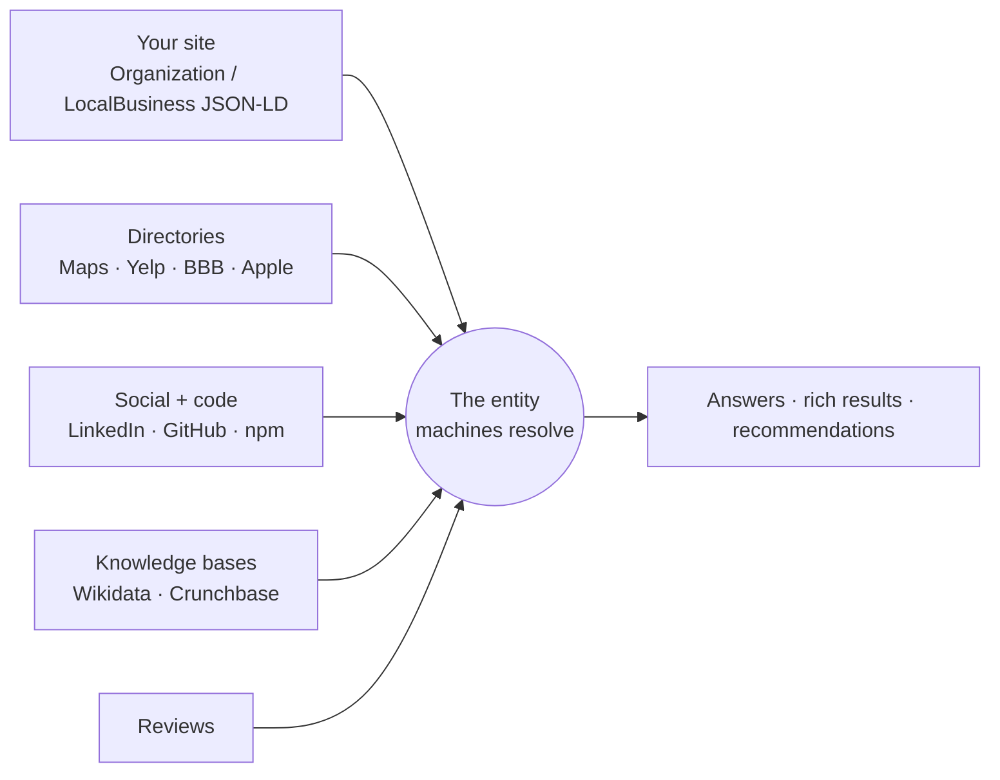

# Entities, E-E-A-T, and trust

Search engines and answer engines don't index *sites*; they resolve **entities** — a company, a product, a person, a place — and then decide how confident they are about each one. This chapter is the mechanics of that resolution: how to declare one identity instead of three, how `sameAs` graphs consolidate you across the web, what the NAP-consistency evidence actually says, why E-E-A-T is an impression you earn rather than a setting you toggle, and why fabricated content is a *discoverability* risk before it is an ethics problem.

The operating idea: **an unfamiliar brand cannot be verified by a language model, so corroboration substitutes for authority.** Entity signals routinely beat page strength for brands the model has never seen.

## Site vs entity

A site is a set of URLs. An entity is a thing with a name, a canonical identifier, attributes, and relationships — which machines assemble from many sources and then merge. Your website is *one* input to that merge, and often not the decisive one.



Three practical consequences:

1. **Contradictions cost you more than gaps.** A missing profile is a gap; two different phone numbers is a contradiction, and contradictions lower confidence in *everything* the machine believes about you.
2. **The merge happens off your property.** You can be immaculate on-site and still be an unresolvable entity because nothing else on the web corroborates you.
3. **Your name is part of the mechanics.** A brand that tokenizes into common words is genuinely hard to resolve. We watched a live SaaS brand return **zero results for its own name** because the dotted, generic name parsed as an ordinary phrase. → [Keyword strategy](../google/keyword-strategy.md)

## Declare one identity

The on-site half of the job is small and precise: **one identity node, one stable `@id`, emitted sitewide, referenced by everything else.**

```jsonc
// Emitted once per page, in <head>. The @id is the anchor everything else points at.
{
  "@context": "https://schema.org",
  "@type": ["LandscapingBusiness", "LocalBusiness"],
  "@id": "https://example.com/#business",
  "name": "Example Outdoor Services",
  "url": "https://example.com/",
  "telephone": "+1-555-0100",
  "address": { "@type": "PostalAddress", "...": "..." },
  "geo": { "@type": "GeoCoordinates", "...": "..." },
  "areaServed": [ { "@type": "City", "name": "…" } ],
  "openingHoursSpecification": [ "…" ],
  "sameAs": [ "…" ]
  // NOTE: no aggregateRating here — see "Ratings belong on a Service node" below
}
```

Per-page nodes then **reference** it rather than restating it:

```jsonc
{ "@type": "Service", "serviceType": "Snow removal",
  "provider": { "@id": "https://example.com/#business" } }
```

### The three failures we actually found live

- **Dangling references.** Per-page `Service` blocks pointed at `provider: {@id: …#business}` while **no `#business` node existed anywhere on the site**. Every service page was asserting a relationship to nothing. Shipping the sitewide node resolved dozens of pages at once — the single highest-yield schema change of that engagement.
- **Two conflicting `Organization` nodes per page.** One carried email and logo; the other carried `alternateName` and an `@id`; one used an `http://schema.org` context and the other `https://`. Two emitters (a platform-level block plus a hand-authored one) that never agreed. **Fix: share one `@id` so consumers merge the nodes instead of seeing two organizations.** If two systems on your stack both emit identity markup, they must agree on the identifier or you are actively fragmenting yourself.
- **A deactivated template fork shadowing the live one.** The identity block was "deployed" and invisible for weeks because a copy-on-write fork of the view was rendering instead of the one being edited. Always verify in the **rendered** HTML. → [Reverse proxies and CMS traps](../technical/reverse-proxy-cms.md)

```bash
# Entity sanity check on any live page
curl -sS "https://example.com/?cb=$(date +%s)" \
  | grep -o '"@type": *"[A-Za-z]*"' | sort | uniq -c
# Expect exactly one Organization/LocalBusiness identity. Two is a bug.
```

## `sameAs` as identity consolidation

`sameAs` is how you tell a machine "these accounts are the same entity as this site". It is the cheapest corroboration lever available, and the most commonly under-built: one lone GitHub URL gives an answer engine essentially no graph to resolve against.

A workable set for a product company:

| Property | Why it carries weight |
|---|---|
| **Wikidata** | Structured, machine-first, feeds knowledge panels and model training pipelines |
| LinkedIn company page | Widely retrieved, strongly associated with real organizations |
| GitHub org | Crawled, permissively-licensed repos enter training corpora, and it's a real agent-discovery surface → [GitHub as a discovery surface](../agents/github-as-discovery.md) |
| Crunchbase | Business-identity corroboration |
| G2 / Capterra (B2B) | Among the most-cited third-party sources for software questions |
| Package registries (npm, PyPI) | Developer-entity corroboration |

For a local business, swap in Google Business Profile (via `hasMap` plus the listing link), Apple Maps, Bing Places, Yelp, BBB, Facebook, and Nextdoor.

**The rule that makes it work: identical name, identical logo, identical one-line description everywhere.** `sameAs` links to profiles that describe you differently corroborate nothing — they hand the merge three candidate descriptions and no tiebreaker. Write the one-sentence description once and paste it, unedited, into every profile.

## NAP consistency, and what the evidence says

NAP = name, address, phone. For local entities it is the highest-leverage consistency work there is.

- Businesses whose NAP is consistent across roughly 20 directories are about **3x more likely** to appear in AI local recommendations (reported research, 2026-07).
- Assistants pull NAP from a **narrow set of trusted aggregators** — the map platforms, Yelp, BBB, the data aggregators behind them. A wrong number in that narrow set means the assistant confidently gives customers the wrong number.

Treat it as byte-level, not approximate: "Suite 200" vs "Ste. 200", `(555) 010-0100` vs `555-010-0100`, "and" vs "&" in the legal name. Pick one rendering, write it down, and reconcile every listing to it.

The reality check that goes with it: a business can be *live* and *invisible*. Auditing one local property, we found the map platform's text search returned **zero results** for the business across name, name-plus-city, address, and phone queries with a 30 km bias — while direct competitors resolved instantly. Direct competitors resolving is the control that proves it's the listing and not the query. That's an unverified or suppressed profile, and until it's fixed no amount of on-site schema will produce a local AI recommendation. → [Google Business Profile](../google/business-profile.md)

## Ratings belong on a Service node

A specific, policy-driven mechanic that catches nearly everyone:

Per Google's December 2025 restatement, **self-serving `aggregateRating` or `Review` on your own `LocalBusiness` or `Organization` node is ineligible and risks a manual action.** Ratings belong on a `Service` (or `Product`) node, backed by reviews that are actually visible on the page. Stars for the business itself belong on the map platform, where the platform owns the collection.

What we shipped, and the shape to copy: a `/reviews` page whose `Service` node carries `aggregateRating` plus an array of `Review` nodes, **each mirroring a real, displayed review verbatim** with a real author name — and the sitewide `LocalBusiness` node carrying no rating at all. → [Reviews — real ones only](../local/reviews.md)

## E-E-A-T is an impression, not a setting

There is no E-E-A-T tag, score, or field. Experience, Expertise, Authoritativeness and Trust are what a quality rater — human or model — concludes after reading your site alongside what the rest of the web says. You build it out of concrete, checkable artifacts:

- **A named human.** A real about page with the owner's name, photo, and bio; a `Person` node with `@id`, `jobTitle`, and `worksFor` pointing at the business; article `author` referencing that same `@id`. Anonymous businesses read as thin.
- **Verifiable credentials, stated plainly.** Founding date, license and insurance status, association memberships — as text, with numbers where numbers exist. **Never as an unlicensed badge.** We stated one compliance-program participation as text only, with no logo, because there was no license to display the mark, and never used "certified" or "compliant" phrasing that wasn't literally true.
- **Real reviews with real authors**, displayed and marked up.
- **Third-party corroboration** — the `sameAs` graph above, plus mentions you didn't write.
- **Facts that agree with themselves.** Which brings us to the failure mode.

## Consistency is a mechanic, not a virtue

Every number repeated across templates will drift, and drift is a machine-visible contradiction.

- A review count diverged across one site's own pages — **47 in one place, 48 in another, 51 in a third** — within days, because the value was hardcoded in dozens of templates. Worse, it also lived in a CMS meta-description field invisible to any grep of the page templates. The fix is architectural: **one stored value, rendered dynamically or patched everywhere by one job**, including `aria-label`s and JSON-LD `reviewCount`.
- Prices conflicted between pages (one bundle listed at two different prices; wall pricing quoted per square foot on one page and per face foot on another — different units entirely) **while the page's own `FAQPage` JSON-LD told Google those prices didn't exist.** Markup that contradicts visible content is a policy problem *and* a confidence problem.

The general rule, which is also Google's structured-data policy: **markup must mirror what's visible.** The most durable way to guarantee that is to generate markup *from* the rendered page rather than hand-author it in parallel — extract the visible Q&A into `FAQPage`, extract the displayed reviews into `Review` nodes. → [FAQ schema from visible content](../local/faq-schema.md)

## Fabrication is a discoverability risk

This is where the book's honesty doctrine stops being about ethics and becomes about mechanics. Fabricated content damages you on four separate axes:

| Fabrication | The discoverability damage |
|---|---|
| Invented testimonials, or reviews attributed to people who don't exist | Contradicts the platforms answer engines actually trust; in the US it's also FTC exposure (16 CFR Part 465) if you claim reviews are verified |
| Self-serving `aggregateRating` on the business node | Explicitly ineligible; manual-action risk |
| Stock or AI-generated images captioned as your own work — worse, declared as `ImageObject` job photos in schema | You are asserting a falsifiable claim to a machine; it's the severest integrity defect class in our audit rubric |
| Made-up statistics in marketing copy | Contradicts anything a model can check, and models increasingly check |

All four are things we found on sites we were fixing — including six invented "— Google review" pull-quotes, seven service-area testimonials matching no customer record and no published review, and marketing copy with fabricated adoption statistics generated by an earlier AI drafting pass. The remediation doctrine that emerged: **reframe rather than delete where possible.** A fabricated case study becomes a clearly-labelled generic example; a stock photo loses its "this exact job" caption and stays as illustration; an unattributed pull-quote gets de-quoted into plain copy. You keep the page and lose the lie.

The full method — image fetch-and-compare against captions, reused-photo dedup, testimonial verification against real records, over-claim checks — is [Authenticity audits](../local/authenticity.md).

## Verification

- [ ] Fetch a live page and census `@type`s — exactly one identity node, no duplicate `Organization`
- [ ] Every `@id` referenced by a per-page node actually exists in some emitted graph
- [ ] Validate in [validator.schema.org](https://validator.schema.org) for parsing and Google's Rich Results Test for eligibility; expect them to report different things
- [ ] No `aggregateRating` on `LocalBusiness`/`Organization`
- [ ] Every marked-up review is visible on the page, verbatim, with a real author
- [ ] `sameAs` resolves to live profiles whose name, logo, and description match the site exactly
- [ ] NAP is byte-identical across your top directories; the business resolves in map-platform text search
- [ ] Any number repeated across templates comes from one source; grep the **rendered** page for stale copies, including meta descriptions and `aria-label`s

## Gotchas

1. **Two emitters, two identities.** A platform-level JSON-LD block plus a hand-authored one, not sharing an `@id`, is a self-inflicted entity split. Consolidate on one identifier.
2. **Dangling `@id` references.** Per-page nodes pointing at an identity node that was never shipped. Free to fix, invisible until you look.
3. **A `sameAs` list of one.** No graph, no corroboration. Build the set, then make the descriptions identical.
4. **Ratings on the business node.** Ineligible since the Dec-2025 restatement, and a manual-action risk. Move them to a `Service` node.
5. **Hardcoded social proof.** It drifts within days and lands in fields you'll never grep. One source of truth, patched everywhere.
6. **Markup that outruns the page.** FAQ answers or prices in JSON-LD that aren't visible on the page. Generate from the rendered content.
7. **Assuming a live business is a findable business.** Check that the map listing actually resolves in text search — with a competitor query as your control.
8. **Fixing the entity on-site only.** The merge happens off-property. Directory and knowledge-base work is the other half, and it's the half with the higher ceiling. → [Off-site signals](../ai-search/offsite-signals.md)

## Related

- [How AI finds and cites](ai-retrieval.md) — why unfamiliar entities need corroboration to get cited
- [Measurement and baselines](measurement.md) — instrumenting entity work
- [Structured data (schema.org)](../google/structured-data.md) — the `@graph` and `@id` patterns in full
- [LocalBusiness schema graph](../local/local-business-schema.md) — the sitewide identity node, implemented
- [Reviews — real ones only](../local/reviews.md) — the ratings policy and live-review sync
- [Authenticity audits](../local/authenticity.md) — finding and remediating fabricated content
- [Keyword and SERP strategy](../google/keyword-strategy.md) — when your brand name itself is the entity problem
- Source skills: [local-business-aeo-schema](https://github.com/ever-just/agentskills/tree/main/skills/local-business-aeo-schema), [marketing-site-authenticity-audit](https://github.com/ever-just/agentskills/tree/main/skills/marketing-site-authenticity-audit), [generative-engine-optimization](https://github.com/ever-just/agentskills/tree/main/skills/generative-engine-optimization)
