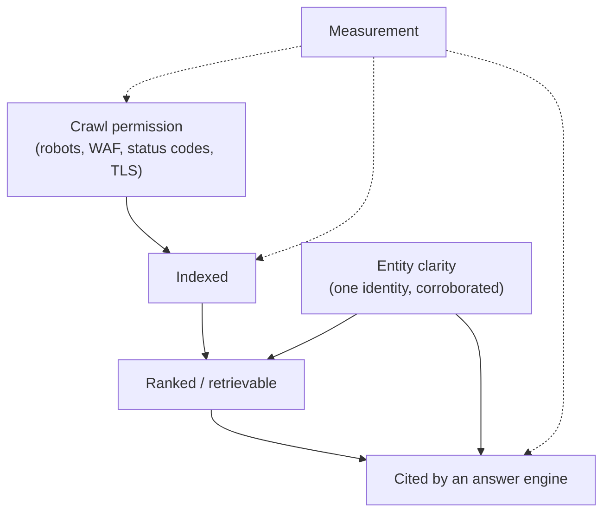

# Foundations

Four chapters on the mechanics underneath every tactic in this book: how a search engine actually turns a URL into a ranked result, how an LLM actually turns a question into a citation, how machines decide *who you are*, and how you know whether any of it worked. Read these once and the rest of the book stops being a list of tips and becomes a set of moves you can reason about.

[How discovery works in 2026](../start/how-discovery-works.md) is the map. This part is the terrain.

## Why mechanics before tactics

Almost every expensive discoverability failure we've shipped through was a **mechanics** failure wearing a tactics costume:

- A local business had immaculate on-page SEO, unique titles, real reviews, and clean structured data — and **zero pages indexed**, because a security product returned a bot challenge to Googlebot. No tactic fixes that. Understanding the crawl-permission gate does. → [Search engines](search-engines.md)
- A SaaS site was correctly indexed by Google and still never appeared in ChatGPT answers, because ChatGPT's search leans on Bing and the property's Bing presence was unmanaged. Knowing *which index feeds which assistant* is worth more than a month of content. → [AI retrieval](ai-retrieval.md)
- A site emitted two conflicting `Organization` blocks per page and a `provider` reference pointing at an entity node that didn't exist. Both "had schema". Neither produced a single confident entity. → [Entities and trust](entities-and-trust.md)
- A team shipped fifteen pages in a day and could not say whether anything improved, because nobody had written down the numbers from the day before. → [Measurement](measurement.md)

Tactics are portable; mechanics are what tells you which tactic applies. When a tactic stops working — and they rotate constantly — the mechanics are what's left.

## The four chapters

- :material-spider-web: **[Search engines — crawl, index, rank](search-engines.md)**
  The pipeline in four stages, and what gates each one. Why *crawl permission*, not crawl budget, is the real problem for sites under a few thousand pages. How canonicalization actually picks a winner. What JavaScript rendering does to the schedule. Where classic ranking factors stand as of 2026.

- :material-robot-outline: **[How AI finds and cites](ai-retrieval.md)**
  The three routes by which an assistant knows you exist, which index each major assistant leans on, what a "citation" is mechanically, and the distinction that decides everything: being *indexed* is not the same as being *retrievable at answer time*. Includes the evidence base, each claim dated and labelled.

- :material-account-check: **[Entities, E-E-A-T, and trust](entities-and-trust.md)**
  Being a resolvable entity rather than a collection of pages. One identity node, cross-linked by `@id`. `sameAs` graphs as identity consolidation. The NAP-consistency evidence. Why E-E-A-T is an impression you earn, not a setting you toggle — and why fabricated content is a *discoverability risk*, not just an ethics problem.

- :material-chart-line: **[Measurement and baselines](measurement.md)**
  Record the numbers before you touch anything. The real customdomain.ai baseline (~5 clicks, ~159 impressions, average position ~42) and how it became the yardstick. AI-visibility spot checks. Estimating any site's traffic from open sources with confidence tiers. Fingerprinting a competitor's stack in ten minutes.

## How these four interlock

Permission gates indexing. Indexing gates retrieval. Entity clarity decides whether a machine that retrieves you can say *who* you are with confidence. Measurement is the loop that tells you which link in that chain is broken — and it is the only one of the four that most operators skip.

## The reading order that pays

1. **[Search engines](search-engines.md)** first, always. Everything downstream inherits its gates.
2. **[AI retrieval](ai-retrieval.md)** next — it reuses the crawl model and adds one hard new idea (answer-time retrievability).
3. **[Entities and trust](entities-and-trust.md)** once you understand what a machine is trying to resolve you *into*.
4. **[Measurement](measurement.md)** before you change anything on a live property. Baselines you didn't record are gone forever.

If you only have twenty minutes: read the crawl-permission section of [Search engines](search-engines.md), then the "indexed is not retrievable" section of [AI retrieval](ai-retrieval.md), then run the [30-minute AI visibility audit](../playbooks/ai-visibility-30min.md).

## Related

- [How discovery works in 2026](../start/how-discovery-works.md) — the landscape map these chapters go beneath
- [Glossary](../start/glossary.md) — definitions for every term used here
- [Google Search Console](../google/search-console.md) — the instrument the measurement chapter assumes
- [AI crawlers and crawlability](../ai-search/ai-crawlers.md) — the operational version of the permission gate
- [Rendering, WAFs, and bot challenges](../technical/rendering-and-waf.md) — where the permission gate breaks in practice
