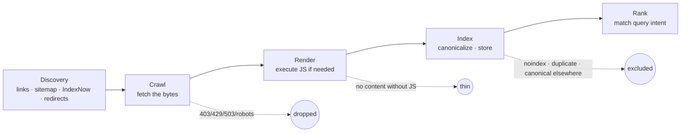

# Search engines — crawl, index, rank

A search engine turns your URL into a result through four stages — **discover → crawl → render → index → rank** — and each stage is a gate that can silently drop you. This chapter is the mechanics of those gates: what makes a URL eligible for the next stage, why the constraint on small sites is *permission* rather than crawl budget, how canonicalization actually picks a winner among duplicates, and what JavaScript rendering costs you. Every failure named here happened on a production site we operated.

## The pipeline



Each arrow is a place where a page that "looks fine in a browser" stops existing to a search engine. The diagnostic discipline that follows from this: **when something isn't ranking, find which stage it died at before changing anything.** Google Search Console's URL Inspection reports the stage explicitly (`coverageState`, `indexingState`, last crawl date) — see [Search Console](../google/search-console.md).

## Stage 1 — Discovery

An engine only crawls URLs it knows about. Four ways it learns:

| Route | Speed | Who honors it |
|---|---|---|
| Links from already-crawled pages (internal and external) | Continuous | Everyone. Still the primary route. |
| An XML sitemap referenced from `robots.txt` and/or submitted in a webmaster console | Days | Google, Bing, most others |
| [IndexNow](../bing/indexnow.md) push | Minutes to hours | Bing, Yandex, Seznam, Naver — **not Google** |
| Redirects, canonical tags, and hreflang pointing at the URL | Continuous | Everyone |

Two dead ends worth knowing so you stop chasing them (both verified 2026-07):

- **The sitemap "ping" endpoint is gone.** Google removed it in 2023; it 404s. Submitting via the console once, plus the `Sitemap:` line in `robots.txt`, is the whole mechanism. After that Google re-crawls on its own schedule, forever.
- **Google's Indexing API is officially JobPosting/BroadcastEvent-only.** It is genuinely the right tool for fast-recrawling job pages — we used it on a handful of `/jobs/*` URLs after fixing their schema. Off-label use on marketing pages risks revocation and buys nothing. "Instant indexing" plugins are the same trap.

For a new domain, plan on **first pages indexed in roughly 2–4 weeks and fuller coverage in 2–3 months** (our observed range across two 2026 launches). Discovery is not the slow part; trust is.

## Stage 2 — Crawl: permission, not budget

This is where most small sites actually die, and it's the least-discussed stage because the popular literature is written for large sites.

### Crawl budget vs crawl permission

**Crawl budget** — the finite rate at which an engine will fetch from your host — is a real constraint at roughly six figures of URLs, or on hosts that respond slowly. If you have 100 or 5,000 pages, you do not have a crawl budget problem. You have a **permission** problem, and permission is binary.

Six ways permission gets revoked, ordered by how often we've found them live:

1. **A bot challenge or WAF rule.** The most destructive, because the site looks perfect to humans. On a live local-business domain in July 2026, a hosting platform's "attack challenge mode" returned **HTTP 429 plus a JavaScript challenge to Googlebot, GPTBot, and PerplexityBot alike** — including on `/robots.txt` and `/sitemap.xml`, so crawlers could not even read the crawl directives. `site:` returned zero pages; the business's Facebook page outranked its own domain. The fix was a platform toggle, not content. → [Rendering, WAFs, and bot challenges](../technical/rendering-and-waf.md)
2. **`Disallow: /` in robots.txt**, often emitted by a CMS that thinks it's on the wrong hostname. → [Reverse proxies and CMS traps](../technical/reverse-proxy-cms.md)
3. **A sitewide `noindex`** — technically an *indexing* gate, not a crawl gate, but it produces the same zero. On one site, Google crawled every page **daily and discarded it**: URL Inspection reported `Excluded by 'noindex' tag` / `BLOCKED_BY_META_TAG` with a fresh last-crawl date. Eleven days of that before anyone looked.
4. **Broken or mismatched TLS.** For a stretch, one brand domain resolved to its server but presented only a platform wildcard certificate. Public HTTPS was broken, so crawling was too. Certificates are a discoverability precondition.
5. **5xx under load.** A small origin that returns 503 to concurrent requests teaches Googlebot to back off and eventually reduce crawl. We measured a tenant returning `Retry-After: 20` under light sequential load — origin fragility is an indexing risk, not just a performance one.
6. **Robots-blocking your own money pages.** A CMS default `Disallow: /shop` was hiding 14 real, sellable product pages on a live site. Always diff `robots.txt` against your sitemap and your actual catalogue.

!!! danger "The one-liner that catches four of the six"
    ```bash
    for ua in "Googlebot/2.1" "bingbot/2.0" "GPTBot/1.1" "PerplexityBot/1.0"; do
      printf '%-22s %s\n' "$ua" \
        "$(curl -sS -o /dev/null -w '%{http_code}' -A "$ua" https://yourdomain.com/)"
    done
    curl -sS https://yourdomain.com/robots.txt | head -20
    curl -sS https://yourdomain.com/ | grep -i 'name="robots"'
    ```
    Run it on the **public** domain, from outside your network. Anything other than `200` from the first block, or any output from the last line, is an emergency. This exact check would have caught the noindex incident on day 1 instead of day 11.

### robots.txt vs meta robots — the distinction that traps people

They are not two flavors of the same thing:

| | `Disallow:` in robots.txt | `noindex` (meta tag or `X-Robots-Tag`) |
|---|---|---|
| Blocks | Fetching | Indexing |
| The page can still appear in results | **Yes** — URL-only, no snippet, from anchor text | No |
| Engine must fetch the page to obey it | No | **Yes** |
| Right tool for | Plumbing paths, faceted URLs, protecting crawl rate | Pages that must not be listed |

The fatal combination is **both at once**: if a URL is `Disallow`ed, the crawler never fetches it, so it never sees the `noindex`, so the URL can linger in the index indefinitely. To de-index, allow the crawl and serve `noindex`. This is exactly why the correct fix for a crawlable duplicate hostname is an `X-Robots-Tag: noindex` header rather than a robots block or a redirect. → [Sitemaps and robots.txt](../google/sitemaps-and-robots.md)

## Stage 3 — Render

Modern crawlers fetch HTML first, then queue pages that need JavaScript for a second, more expensive rendering pass. Three consequences:

- **Rendering is deferred and rationed.** Content that exists only after client-side JS appears later than server-rendered content, and on low-authority sites can be deferred a long time. Server-render or pre-render anything that must be indexed.
- **AI fetchers are stricter than Googlebot.** Several on-demand LLM fetchers do not execute JavaScript at all. A page that Google eventually renders may be permanently empty to them. → [AI retrieval](ai-retrieval.md)
- **Verify with `view-source`, not devtools.** Devtools shows the DOM *after* JS. `curl` and view-source show what a non-rendering crawler receives. Two different documents.

```bash
# What a non-rendering fetcher actually gets: title, H1, and schema presence
curl -sS https://yourdomain.com/page | \
  grep -Eo '<title>[^<]*|<h1[^>]*>[^<]*|application/ld\+json' | head
```

A related trap on the tooling side: **do not trust a page-summarizing tool's report about markup.** A fetch-and-summarize tool once told us a page was missing image alt text; raw `curl` proved every image had it. Ground truth is the bytes.

## Stage 4 — Index and canonicalization

The index stores one canonical document per cluster of duplicates. Canonicalization is the process of choosing it, and `rel="canonical"` is **a strong hint, not an instruction**. The engine weighs:

- The `rel="canonical"` you declare (and whether pages agree with each other)
- Redirect targets
- Which URL your internal links and sitemap actually point at
- HTTPS over HTTP, and which variant is more linked
- `hreflang` clusters

Failure modes we've hit, all mechanical:

- **Self-referencing canonicals are the safe default.** Every page canonical to itself, in absolute form, on the public host. Cross-domain canonical leakage — pages canonical to a hostname the public never uses — hands the index a different site.
- **A crawlable duplicate host splits everything.** On multi-tenant platforms the internal machine hostname is often publicly reachable and serves a byte-complete copy of the site, sometimes publishing its own sitemap. Fix with `noindex` on that host, never a redirect (redirecting it breaks OAuth callbacks, webhooks, and links in already-sent mail).
- **Canonical vs `og:url`.** Only the canonical governs indexing; `og:url` affects social previews. We watched a team touch an indexing-governing configuration field to fix a cosmetic `og:url` and re-`noindex` a live site. Know which tag does what before you optimize the wrong one.
- **Sitemap/canonical disagreement undercuts submissions.** If you submit URLs on one host while canonicals point at another, you're telling the engine to discard what you just submitted — and it degrades [IndexNow](../bing/indexnow.md) pushes too.
- **Fake freshness is a trust cost.** Emitting `lastmod: now` on every URL every build is not neutral; `<lastmod>` only helps re-crawl scheduling if it's honest. Missing `<lastmod>` is a minor loss; lying is worse.

**How you know it worked:** in Search Console, URL Inspection reports "Google-selected canonical" — compare it to your declared canonical on a handful of representative URLs. Disagreement is the signal; the reason is upstream in the list above.

## Stage 5 — Ranking, as of 2026

Ranking is the least mechanical stage and the most over-theorized. What we can say with confidence, dated:

**Still load-bearing (as of 2026-08):**

- **Intent match.** The page that most directly answers the query's actual job wins. This is why keyword research is really demand research. → [Keyword strategy](../google/keyword-strategy.md)
- **Links and mentions from relevant sources.** Still the strongest off-site signal, and now doing double duty: the sources that link you are disproportionately the sources answer engines retrieve. → [Off-site signals](../ai-search/offsite-signals.md)
- **Site-level quality judgments.** Thin, templated, near-duplicate page farms lose. We audited a set of city pages that were **72% similar with the city name blinded**, and 22 thin street-level pages that were classic doorway pages — those were consolidated with 301s and de-indexed rather than defended. Copying an incumbent's ~5,900-page location×service farm is not a strategy available to a small operator.
- **Freshness, where the query deserves it.** Seasonal and news-shaped queries reward recency; evergreen definitions don't.

**Real but smaller than the internet claims:**

- **Core Web Vitals / page experience** — a tiebreaker, not a lever. Worth fixing because it's cheap (one platform we operated shipped with compression off entirely, ~166–211 KB of uncompressed HTML per page) but it will not rescue a page with no intent match.
- **Structured data does not rank you.** It changes how you're *presented* and how confidently machines parse you. That's a real payoff — just not a ranking one. → [Structured data](../google/structured-data.md)

**Dead, and still repeated:**

- **Exact-match domain bonus** — gone since 2012. Buying a generic keyword domain buys you nothing but, occasionally, a real liability: a dotted generic brand can tokenize into common words and return **zero results for your own name**. → [Keyword strategy](../google/keyword-strategy.md)
- **Keyword density, AI-specific rewriting, and tiny-chunk fragmentation** — Google has explicitly named the latter two as ineffective.

The honest summary: for a young, low-authority property, ranking is mostly a function of *choosing a query you can actually win* and being mechanically clean enough to compete for it. Our own measured baseline on a young SaaS domain — impressions on exactly the right intents at average positions in the 40s–70s — was not a penalty. It was an unranked-but-healthy site being told, correctly, that it hadn't earned those terms yet.

## Verification checklist

Run this after any infrastructure, CMS, or domain change:

- [ ] `curl` the homepage as Googlebot, bingbot, GPTBot, PerplexityBot → all 200
- [ ] `robots.txt` on the public host is what you wrote, with the right `Sitemap:` line
- [ ] No `noindex` in the rendered HTML of a public page (`grep -i 'name="robots"'`)
- [ ] Sitemap `<loc>` entries use the public host and return 200
- [ ] Declared canonical is self-referencing and absolute on the public host
- [ ] `view-source` (not devtools) shows your title, H1, body copy, and JSON-LD
- [ ] URL Inspection on 3–5 URLs: crawled, indexed, Google-selected canonical matches yours
- [ ] Indexed page count in Search Console is in the same order of magnitude as your sitemap

## Gotchas

1. **Assuming crawl budget is your problem.** Under a few thousand URLs it almost never is. Check permission first; you'll find the real bug faster.
2. **`Disallow` + `noindex` on the same URL.** The crawler never sees the `noindex`. Allow the crawl if you want de-indexing.
3. **Verifying on the wrong host.** Caches, proxies, and CMS host-mismatch logic serve different bytes on the internal host than on the public one. Verify where crawlers fetch.
4. **Treating Search Console as an alarm.** It lags by days. It's your confirmation instrument; `curl` is your alarm.
5. **A single failed fetch read as a regression.** Small origins throw transient 503s. Re-fetch once before concluding anything broke — and pace your own verification sweeps sequentially with backoff, or you'll manufacture the outage you're testing for.
6. **Chasing an "instant index" button.** It doesn't exist for Google. IndexNow is real, feeds Bing and friends, and is therefore an [AI-visibility](ai-retrieval.md) lever — not a Google one.
7. **Optimizing `og:url` by touching indexing config.** Cosmetic social-preview bugs are not worth risking the tag that governs indexing.
8. **Believing a summarizer over the raw HTML.** Ground truth is `curl`.

## Related

- [How AI finds and cites](ai-retrieval.md) — the same pipeline, plus answer-time retrieval
- [Measurement and baselines](measurement.md) — how to know which stage you're stuck at
- [Google Search Console](../google/search-console.md) — the instrument for stages 1–4
- [Sitemaps and robots.txt](../google/sitemaps-and-robots.md) — the operational chapter on discovery and permission
- [Rendering, WAFs, and bot challenges](../technical/rendering-and-waf.md) — where crawl permission breaks
- [Reverse proxies and CMS traps](../technical/reverse-proxy-cms.md) — the catalog of silent indexing bugs
- Source skills: [generative-engine-optimization](https://github.com/ever-just/agentskills/tree/main/skills/generative-engine-optimization), [reverse-proxy-cms-indexing](https://github.com/ever-just/agentskills/tree/main/skills/reverse-proxy-cms-indexing), [everjust-website-seo](https://github.com/ever-just/agentskills/tree/main/skills/everjust-website-seo)
