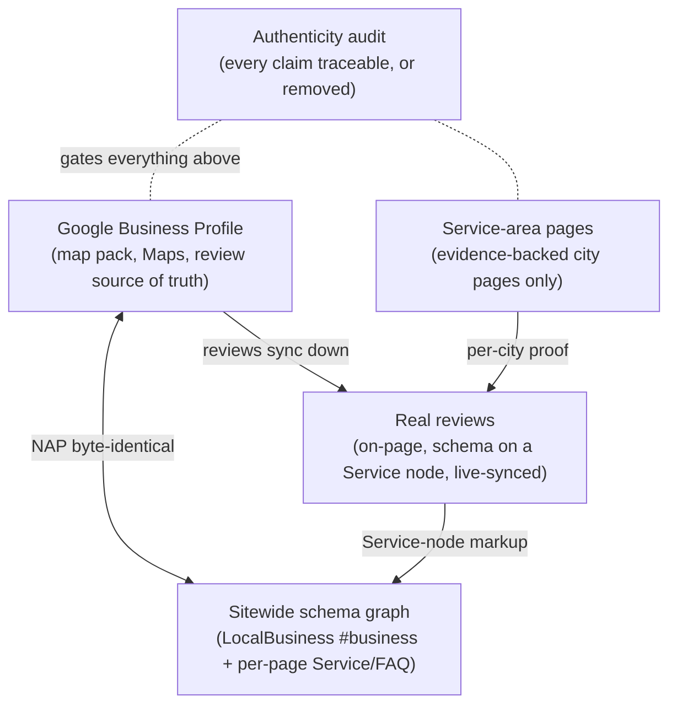

# Local Business

For a local service business, discoverability is one interlocking stack, not five separate chores: a Google Business Profile, a sitewide schema graph, real reviews, service-area pages that survive scrutiny, and an authenticity standard that holds it all together. Search engines and AI assistants cross-check these layers against each other — a contradiction in any one of them (a wrong phone number in a directory, a fabricated testimonial, a star rating on the wrong schema node) degrades all the others. This part teaches the stack as we actually shipped it, layer by layer, on a real business.

## The stack

Five layers, five chapters:

1. **[LocalBusiness schema graph](local-business-schema.md)** — one sitewide `LocalBusiness` node with `@id` `#business` injected into `<head>`, resolving every page's `provider` reference; per-page Service and BreadcrumbList graphs; NAP consistency across site, GBP, and directories.
2. **[FAQ schema from visible content](faq-schema.md)** — FAQPage generated deterministically from the Q&A the page actually renders, so schema can never drift from visible content.
3. **[Reviews — real ones only](reviews.md)** — Google's December 2025 policy (stars on a Service node, never on the business), real reviews with real authors and verbatim bodies, and the live-sync architecture that keeps a rating honest across every surface that repeats it.
4. **[Service-area pages](service-areas.md)** — the city-limits verification test that separates legitimate city pages from doorway spam, GPS-proven photos, Census TIGER maps, and the honest-coverage alternative.
5. **[Authenticity audits](authenticity.md)** — image-fetch-and-compare, reused-photo dedup, fabricated-testimonial detection, and the honest-generic remediation doctrine — run as SEO defense, not just ethics.

## Why AI raised the bar for local

Classic local SEO rewarded volume: more city pages, more testimonials, more stars, wherever you could put them. Answer engines punish exactly that, because they cross-source. Research the case-study engagement relied on (industry studies, as of 2026-07 — reported, not our own measurement):

- AI assistants use reviews as a **confidence threshold** — roughly a 4.3-star bar before recommending a local business.
- AI pulls your name/address/phone from a **narrow trusted set** (Yelp, BBB, data aggregators). One wrong number there and the AI recites a wrong contact.
- Businesses with consistent NAP across ~20 directories were ~3x more likely to appear in AI local recommendations.
- Rich structured data appeared in ~61% of ChatGPT-cited pages vs ~25% of ordinary URLs; three or more schema types per page correlated with more citations.

The uncomfortable corollary: fabricated local proof — invented testimonials, one photo captioned as seven different jobs, city pages for places you've never worked — is now a *machine-detectable* liability with policy (Google manual actions) and legal (FTC) teeth. The [authenticity chapter](authenticity.md) treats honesty as the ranking strategy it has become.

## The backbone case

Every chapter here is grounded in one engagement: **headsupoutdoorservices.com**, a family lawn-care, landscaping, and snow-removal company in Shakopee, Minnesota, taken through the full local stack in July 2026. The starting state was instructive:

- The brand's live domain sat behind a bot-challenge wall returning 429 to Googlebot, GPTBot, and PerplexityBot — `site:` showed **zero indexed pages**, and the company's Facebook page outranked its own website.
- The site had Service schema pointing at a `#business` entity that was defined nowhere.
- A "4.9 · 51 Google reviews" claim was hardcoded in up to ~92 places and had already drifted out of sync with reality.
- 22 thin street- and neighborhood-level "service area" pages were linked in every footer — classic doorway spam, three of them advertising service on sovereign tribal land.
- The Google Business Profile itself was invisible: Places text search returned zero results for the business by name, city, address, or phone while direct competitors resolved instantly.

Over three weeks, each problem became a chapter of this part: the schema graph shipped and verified 2026-07-11, the honest review markup the same night, the domain and Search Console wired 2026-07-18, the service-area teardown and rebuild 2026-07-29, with the authenticity audit running through all of it. The full chronological narrative, including the failures, is in the [case study](../case-studies/headsup.md).

## What this part is not

- **Not GBP setup mechanics.** Claiming, categories, and the API-access reality (Business Profile API ships at quota 0 until Google approves you) live in [Google Business Profile](../google/business-profile.md). This part covers how the *site* connects to GBP.
- **Not the citations program.** Building presence on the ~50 directory platforms — the claim-first doctrine, per-platform triage, what an agent can and cannot do (account creation blocks everything) — is off-site work covered in [Off-site signals](../ai-search/offsite-signals.md).
- **Not crawlability triage.** If a WAF or bot challenge is hiding your site from crawlers entirely, no local optimization matters. Start at [Rendering, WAFs, and bot challenges](../technical/rendering-and-waf.md).

If you want the whole stack as an ordered launch sequence, the [local-business playbook](../playbooks/local-business.md) compresses this part into steps.

## Related

- [Google Business Profile](../google/business-profile.md) — the profile side of the local stack
- [Launch a local business](../playbooks/local-business.md) — this part as an ordered playbook
- [Heads Up Outdoor Services case study](../case-studies/headsup.md) — the backbone case, end to end
- [Off-site signals](../ai-search/offsite-signals.md) — directories, citations, and where AI actually looks
- [Entities, E-E-A-T, and trust](../foundations/entities-and-trust.md) — why consistency and honesty are entity signals
- Source skills: [local-business-aeo-schema](https://github.com/ever-just/agentskills/tree/main/skills/local-business-aeo-schema), [marketing-site-authenticity-audit](https://github.com/ever-just/agentskills/tree/main/skills/marketing-site-authenticity-audit)
