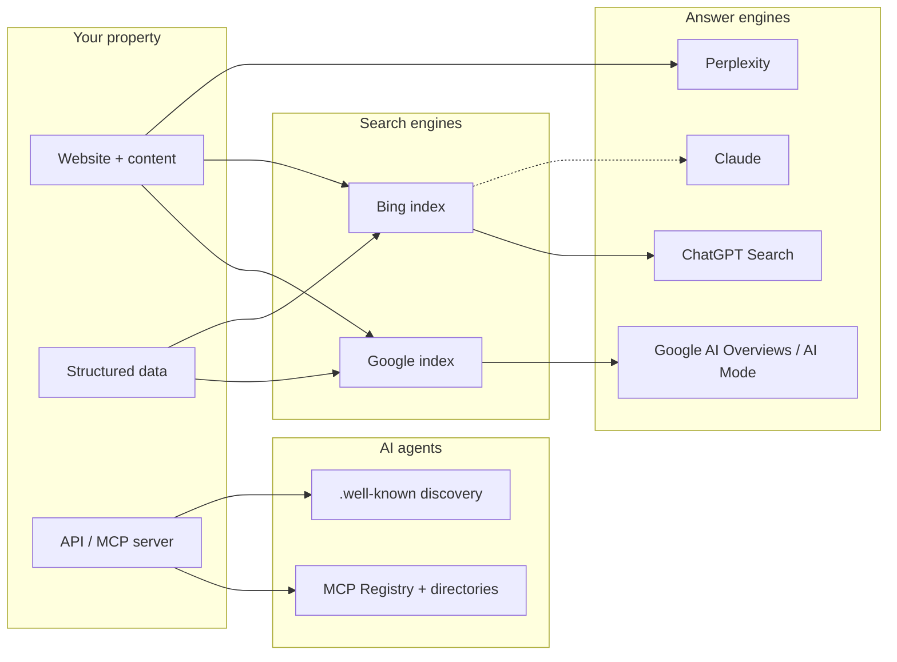

# How discovery works in 2026

The map of "how people find things" has three layers now, and they feed each other in non-obvious ways. Understanding the plumbing tells you where effort actually pays off.

## The three layers

**Search engines** crawl and index your pages. Google and Bing remain the two indexes that matter — not because people use Bing, but because of who *else* uses Bing.

**Answer engines** sit on top of search indexes. Google's AI Overviews and AI Mode draw on Google's index. ChatGPT's search draws heavily on Bing plus its own crawl (GPTBot / OAI-SearchBot). Perplexity runs its own crawler (PerplexityBot) plus partner indexes. This is the single most under-appreciated fact in the field: **optimizing for Bing is optimizing for ChatGPT.**

**AI agents** don't search the web the way humans do. When an agent needs a capability — "connect a domain", "book an appointment" — it consults MCP registries and directories, resolves `/.well-known/` discovery endpoints, and reads tool descriptions. This layer has almost no competition yet, which makes it the cheapest land-grab in the book.

## The three ways an AI knows you exist

When ChatGPT or Claude mentions a brand, that knowledge arrived by one of exactly three routes:

1. **Training data.** Your content (and content *about* you) was in the corpus at training time. Slow, uncontrollable, favors old and widely-referenced sources — but it's why off-site presence (directories, Reddit, GitHub, reviews) compounds.
2. **Search grounding.** The assistant ran a live search and read the results. This is where most citations come from today — and it means classic crawlability and ranking still gate AI visibility. If a bot can't fetch your page (robots block, WAF challenge, client-side rendering), you cannot be cited, period.
3. **User-supplied context.** The user pasted your URL or used a deep link. You control this route directly — see [the Ask-AI widget](../ai-search/ask-ai-widget.md).

## What changed vs classic SEO — and what didn't

| Still true | Newly true |
|---|---|
| Crawlability gates everything | A WAF "bot challenge" mode can erase you from AI answers while your site looks fine to humans |
| Content quality and intent-matching win | Content must be *quotable* — answer-first, self-contained blocks an LLM can lift verbatim |
| Structured data helps machines parse you | Structured data is now read by answer engines, not just rich-result renderers |
| Reviews and reputation drive local | Only **real** reviews survive — schema policies now explicitly punish self-serving ratings |
| Links and mentions build authority | Mentions in the sources LLMs retrieve (Reddit, directories, comparison pages, GitHub) drive *citations* |
| One domain, one brand | Your brand name itself is a strategic choice — dotted generic names can be nearly unsearchable ([the tokenization crisis](../google/keyword-strategy.md)) |
| — | A whole machine-only layer exists: registries, manifests, OAuth discovery, DNS-based endpoint resolution |

## Where effort pays off, in order

For most properties, ranked by leverage-per-hour as we've measured it in practice:

1. **Verify you're crawlable** — by Googlebot, Bingbot, *and* the AI crawler roster. Minutes to check, catastrophic when wrong. → [AI crawlers](../ai-search/ai-crawlers.md), [Rendering & WAFs](../technical/rendering-and-waf.md)
2. **Set up measurement** — Search Console + Bing Webmaster Tools, record baselines. → [Measurement](../foundations/measurement.md)
3. **Ship correct structured data** — the schema graph appropriate to what you are. → [Structured data](../google/structured-data.md)
4. **Win a winnable keyword niche** — not your dream head term. → [Keyword strategy](../google/keyword-strategy.md)
5. **Publish answer-first content for intent queries** — the cluster model. → [Content that gets cited](../ai-search/content-that-gets-cited.md)
6. **Claim the agent layer** — registry + discovery endpoints if you have an API. → [AI Agents](../agents/index.md)
7. **Build off-site presence where AIs retrieve** — earned, not astroturfed. → [Off-site signals](../ai-search/offsite-signals.md)

Everything else in this book is depth on one of those seven moves.
