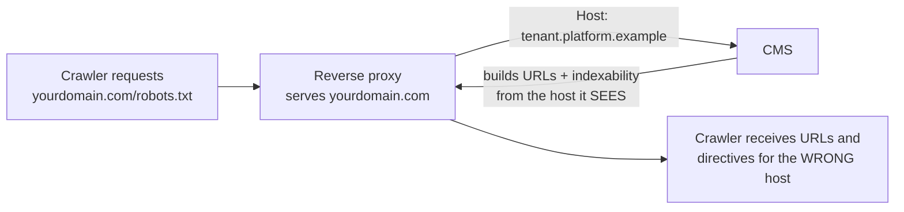

# Reverse proxies and CMS traps

**When a reverse proxy rewrites the `Host` header before your CMS sees the request, the CMS builds every URL — and every indexability decision — from a hostname the public never sees.** The result is a whole family of silent disasters: robots.txt that says `Disallow: /`, a sitewide `noindex` meta tag nobody wrote, sitemaps and canonicals advertising an internal hostname, and an internal host that's a fully crawlable duplicate of your site. Every one of these shipped on real production sites behind this architecture; every one was invisible from inside the CMS.

This is the standard multi-tenant pattern — nginx (or Cloudflare) serves `yourdomain.com` but forwards the request with `Host: tenant.platform.example` so the app can route to the right tenant — so if your site runs on a hosted CMS, a white-label platform, or any proxy that terminates the public domain, this chapter is your trap catalog.

## The architecture that causes it all



The app is not misconfigured — it's answering honestly for the host it was given. Only two layers can fix the mismatch: the proxy (which knows the real public host) or the app's own configuration (which must then survive the mismatch check). That asymmetry drives every fix below.

## The trap catalog

### Trap 1 — robots.txt emits `Disallow: /`

Many CMSs (Odoo is the documented example — this is open-source code) guard robots.txt with a domain-match check, pseudocode:

```text
if configured_domain is set and request_host != configured_domain:
    emit "Disallow: /"          # assume this is a staging/duplicate host
```

Sensible on a directly-served site; catastrophic behind a Host-rewriting proxy, where `request_host` is the internal hostname and **can never match** the configured public domain. The public site serves `Disallow: /` — blocking Googlebot, Bingbot, and every AI fetcher — while every page still returns 200 and looks perfect.

**Fixes, in order of robustness (all shipped and verified 2026-07):**

1. **Static robots.txt at the proxy** — an nginx `location = /robots.txt { return 200 '...'; }` mirroring your intended directives (including your [AI-crawler allows](../ai-search/ai-crawlers.md)). The CMS is no longer in the loop, so the trap can't re-fire.
2. A CMS-level template override forcing the mismatch clause off — works, but survives only until a platform update rediscovers it.

### Trap 2 — the sitewide `noindex` (the incident to remember)

The same domain-mismatch check often gates a second, worse output: the page layout's `<meta name="robots" content="noindex"/>`.

**The real incident (2026-07):** a local-business site was migrated to its brand domain. Eleven days later, a Search Console pull showed 24 clicks / 640 impressions over 90 days — all brand queries — and URL Inspection said every page was `Excluded by 'noindex' tag`. Google had been crawling daily and discarding every page. The live HTML confirmed `noindex` sitewide. Root cause: the CMS's domain field was set to the public domain, the proxy rewrote `Host` to the internal machine host, the equality check could never pass, so the layout stamped `noindex` on every page **since the day of the migration**. The fix was one field: clear the CMS's domain setting — canonicals stayed correct because they fall back to the (frozen) base-URL setting.

The same afternoon, a parallel work session — trying to fix a cosmetic `og:url` showing the internal host — **re-set that domain field and re-noindexed the live public site. It was reverted in seconds**, but only because the first session had just documented the causal chain. Two lessons:

- On a Host-rewriting platform, the CMS's "domain" field is a loaded gun. Know what your CMS *does* with it before setting it.
- A cosmetic wrong-host `og:url` is not worth touching the field that governs indexing. **Canonical is the tag that governs; og:url affects social previews only.**

!!! danger "Verify indexability from outside after every migration or domain-field change"
    `curl -sS https://yourdomain.com/ | grep -i 'name="robots"'` — on the public domain. This one-liner would have caught the incident on day 1 instead of day 11. GSC's URL Inspection is the confirmation, not the first alarm — it lags.

### Trap 3 — sitemap and canonicals advertise the internal host

The sitemap's `<loc>` entries and robots.txt's `Sitemap:` line are typically built from the request's `url_root` — the internal host. Submitting that sitemap tells search engines your site lives on the platform hostname; mismatched canonicals also undercut [IndexNow/Bing submissions](../bing/indexnow.md) until aligned.

**Fix at the proxy** — only it knows the public host. Rewrite the response body on the way out:

```nginx
location ~ ^/sitemap.*\.xml$ {
    proxy_pass http://app_upstream;
    proxy_set_header Host tenant.platform.example;  # keep tenant routing working
    proxy_set_header Accept-Encoding "";            # sub_filter silently no-ops on gzip!
    sub_filter_once off;
    sub_filter_types text/xml application/xml;
    sub_filter 'tenant.platform.example' 'yourdomain.com';
}
```

The `Accept-Encoding ""` line is load-bearing: `sub_filter` cannot rewrite compressed bodies and **fails silently** without it. The same block pattern (with `sub_filter_types text/plain`) fixes a proxied robots.txt's `Sitemap:` line if you didn't go fully static per Trap 1.

### Trap 4 — the internal host is a crawlable duplicate

On a wildcard platform domain, the internal hostname is itself publicly reachable — a complete, crawlable duplicate of your site, splitting crawl equity and able to get indexed in its own right (one machine host was found publishing its own complete sitemap).

**Fix: noindex it, never redirect it.** The internal host is plumbing — it typically serves tenant routing, OAuth callbacks, webhooks, and links in already-sent emails. A 301 breaks all of that. Instead, give that exact hostname its own proxy server block (a specific `server_name` beats the platform's wildcard match) that proxies identically but adds:

```nginx
add_header X-Robots-Tag "noindex, nofollow" always;
```

The duplicate drops out of indexes; the plumbing keeps working. Verify both directions: public host has **no** noindex; internal host returns 200 **with** it. Apply the same header (plus a static `Disallow: /` robots.txt) to `admin.` and other human-entry aliases.

## The cache stack that eats your fixes

Behind a proxied CMS, an SEO edit can be correct in the database and still not serve. Four distinct layers did this to us in one engagement:

| Layer | Behavior | The move |
|---|---|---|
| **CMS sitemap cache** | Sitemap rendered once, stored as an attachment, regenerated ~every 12h. New pages and domain changes don't appear until it expires. | Delete the cached sitemap object after any domain/robots/page change that affects it. |
| **Proxy content cache** | nginx cached robots.txt on the public vhost — the CMS field was correct, the internal host served the new file, the public domain served the stale one. `Cache-Control: no-store` and query-busting did **not** defeat it. | Add a cache-bypass rule for `/robots.txt` and `/sitemap*.xml`, or purge on change. Always verify on the public host. |
| **Compiled-template cache** | Template edits made out-of-band (e.g. via a server-side shell) don't render until an app restart; edits through the CMS's own web/API lane invalidate immediately. The cache rule is **write-path-dependent**. | Know which lane you're editing through. If a correct edit "didn't work," suspect the cache before re-editing. |
| **CDN asset cache** | A CDN cached a fixed JS asset for ~4h, so a shipped fix wasn't what visitors received. | Set explicit cache headers at the origin; know who can purge (a DNS-only API token can't). |

And the imposter that looks like a cache problem but isn't: **editing the wrong copy of a view.** CMSs with copy-on-write templates can hold a base version and a site-specific fork under one name — the fork renders, and edits to the base succeed silently with zero effect. One site's schema block was "deployed" but invisible for weeks because a *deactivated* fork was shadowing the base view. Much "you must restart for edits to show" folklore traced back to this. Resolve which copy actually renders before editing.

**The rule that survives all of it: after every SEO-relevant edit, fetch the LIVE public page — cache-busted, on the public domain — and grep for your change.** Not the editor preview, not the internal host, not the database.

```bash
curl -sS "https://yourdomain.com/?cb=$(date +%s)" | grep -c 'ld+json'
curl -sS "https://yourdomain.com/robots.txt?cb=$(date +%s)"
```

## Pace your writes and probes: fragile origins

Small CMS origins fall over under concurrency — one production tenant returned 503 under a handful of parallel requests. Two consequences:

- **Your own verification sweeps must run sequentially with backoff**, or they'll manufacture false "regressions" out of transient 503s. Re-fetch once before concluding anything broke.
- **Crawlers hitting 503s throttle or drop your crawl** — Googlebot backs off a host that errors under load. Origin fragility is itself an indexing risk (and a reason to fix compression and image weight; see the performance notes in the [case study](../case-studies/everjust-tenants.md)).

## Editing shared proxy config safely

The proxy config in this architecture is shared blast radius — a syntax error takes down every tenant. The process that's kept us safe (shipped practice):

1. **Back up** the live config file first.
2. Make **additive** edits — new `server`/`location` blocks collide with nothing.
3. **Validate** (`nginx -t`) before any reload/restart; if validation fails, restore the backup and do *not* restart — the running process still holds the last good config.
4. **Restart rather than reload when the config is a bind-mounted file** — file replacement changes the inode, and a reload keeps reading the orphaned old file while reporting success. (One box ran a six-day-old config this way; compare host vs in-container inodes to detect it.)
5. **Commit the change to the deploy source of truth.** Deploys that sync config from the repo revert box-only edits — our robots/sitemap fixes were only durable once committed.

## Gotchas

1. **Setting the CMS's domain/canonical field behind a Host-rewriting proxy noindexes the public site** (Traps 1–2). If og:url is your only symptom, leave the field alone.
2. **`sub_filter` on a gzipped body does nothing, silently.** Always pair it with `Accept-Encoding ""`.
3. **Redirecting the internal host** breaks OAuth/webhooks/email links. `X-Robots-Tag: noindex` is the tool; a 301 is not.
4. **Trusting the machine host as your verification target.** Every cache/proxy trap above serves different bytes on the public host. Verify where crawlers fetch.
5. **"It needs a restart" folklore hiding a wrong-view edit.** Check which template copy renders (fork vs base, active flags) before blaming caches.
6. **Robots/sitemap fixes that vanish on the next deploy** because they lived only on the box. Commit to the config's source of truth.
7. **Parallel sessions/tools re-breaking each other.** The noindex incident recurred within hours because two workstreams touched the same field with different goals. Document causal chains where the next operator will hit them.
8. **A default `Disallow:` line hiding money pages.** One platform default blocked `/shop` — including 14 real, sellable product pages. Diff robots.txt against your sitemap and catalogue before trusting any default (see [Sitemaps and robots.txt](../google/sitemaps-and-robots.md)).

## Related

- [Domain migrations](domain-migration.md) — these traps fire *during* cutovers; the checklist bakes the fixes in
- [Rendering, WAFs, and bot challenges](rendering-and-waf.md) — the other way infrastructure serves crawlers something else
- [Sitemaps and robots.txt](../google/sitemaps-and-robots.md) — what the corrupted files should say
- [everjust.app tenants case study](../case-studies/everjust-tenants.md) — the platform where this catalog was assembled
- Source skills: [reverse-proxy-cms-indexing](https://github.com/ever-just/agentskills/tree/main/skills/reverse-proxy-cms-indexing), [everjust-website-infra-views](https://github.com/ever-just/agentskills/tree/main/skills/everjust-website-infra-views)
